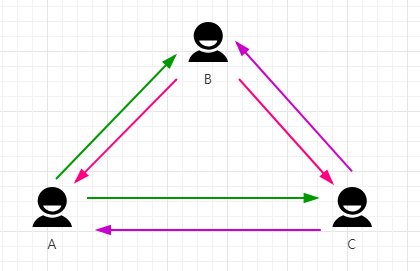
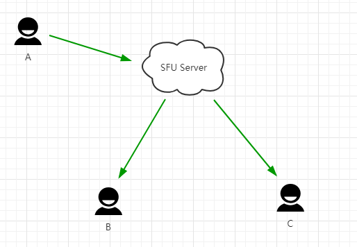

# 网络音视频交互架构

- [网络音视频交互架构](#网络音视频交互架构)
  - [音视频通信场景](#音视频通信场景)
  - [SFU + Mesh](#sfu--mesh)
  - [参考](#参考)

## 音视频通信场景

1. Mesh：一对一的实施音频互动，在 webrtc 技术规范中，通信方式推荐以 P2P 为主，即通信双方的音视频流数据直接点到点传输，无需经过服务端程序的中转，网络拓扑图如下图。
   - 优点：无需服务端中转，服务器的开销低；传输质量好（传输质量依赖客户端自身的带宽情况）；

        

   - 缺点：端结构简单。如果再有第三个人加入进来群聊，每个端需要维护 4 个连接， 两个上行，两个下行，每个端要维护的连接数剧增，带宽资源消耗大，而且每个连接产生的音视频数据都需要编解码，还得考虑编解码的 CPU 消耗，每个端的网络资源和 CPU 资源消耗较多。

        

2. SFU：Mesh 架构在人数较少的通信场景中表现良好，但应对多人的场景就比较吃力，为了支持多人的场景，如人数较多的视频群聊/视频会议，于是演化出新得架构 —— SFU，如下图。SFU 架构较 Mesh 来讲，节省了发送端的上行连接，带来的代价就是部署 SFU 服务，SFU 服务只做转发，不涉及编解码，所以服务端的压力较小，在多人的同时通信中推荐使用。
   - 优点：视频发送方只需维护一个上行连接，由 SFU 服务器自行分发流数据到对应的接收端；如图中，A 向 B 和 C 发送数据，无需单独一个一个发，而是统一发到 SFU 服务器即可，较 Mesh 架构来说，在发送端节约了上行的资源。

        

   - 缺点：在接收端，即下行连接还是没有解决，有 N 个发送端就有 N-1（不包含自己，自己看自己的视频无需网络传输）个下行连接。

        

3. MCU：上行和下行都只有一个连接的架构称之为 MCU 架构。
   - 优点：每个端只需要上行下行连接各一路流。

        

   - 缺点：编解码以及合流（因为每个端只有一个下行连接，但这个连接里含有多个发送端的流，所以需要合起来传输）由 MCU Server 来承担，虽然从带宽上解决了客户端问题，但是服务器的压力很大，这种模式也就是传统的视频会议的架构。

## SFU + Mesh

以解决 6 人以内的音视频通信问题为例，先通过 MESH 介绍 WebRtc 各类 API，接下来实现一个高并发音视频服务器。

A/B 之间音视频处理需要考虑的问题点：

1. 音视频处理：音视频流的采集，优化处理（图形增强、音频降噪），编解码，播放；
2. 网络传输：流数据，文本数据，其他二进制数据。

## 参考

1. [搞定WebRTC音视频直播通信技术（核心技术精讲篇）](https://www.cnblogs.com/rajan/p/12308606.html)
