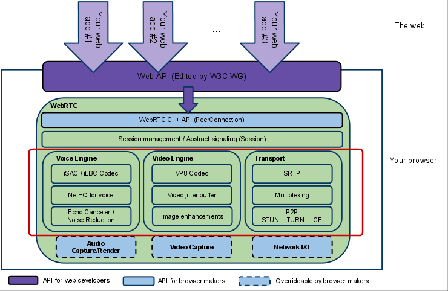

# WebRtc 初识

- [WebRtc 初识](#webrtc-初识)
  - [什么是 WebRtc](#什么是-webrtc)
  - [WebRtc 架构](#webrtc-架构)
    - [WebRtc 架构组件](#webrtc-架构组件)
    - [模块细致讲解](#模块细致讲解)
  - [引用](#引用)

## 什么是 WebRtc

WebRTC（Web Real-Time Communication）项目的最终目的主要是让 Web 开发者能够基于浏览器（Chrome\FireFox\…）轻易快捷开发出丰富的实时多媒体应用，而无需下载安装任何插件，Web 开发者也无需关注多媒体的数字信号处理过程，只需编写简单的 Javascript 程序即可实现。

## WebRtc 架构



- 架构图颜色标识说明：
  1. 紫色部分是 Web 开发者 API 层；
  2. 蓝色实线部分是面向浏览器厂商的 API 层；
  3. 蓝色虚线部分浏览器厂商可以自定义实现。

### WebRtc 架构组件

1. Your Web App：Web 开发者开发的程序，Web 开发者可以基于集成 WebRTC 的浏览器提供的 web API 开发基于视频、音频的实时通信应用。
2. Web API：面向第三方开发者的 WebRTC 标准 API（Javascript），使开发者能够容易地开发出类似于网络视频聊天的 web 应用。
3. WebRTC Native C++ API：本地 C++ API 层，使浏览器厂商容易实现 WebRTC 标准的 Web API，抽象地对数字信号过程进行处理。
4. Transport / Session：传输/会话层，会话层组件采用了 libjingle 库的部分组件实现，无须使用 xmpp/jingle 协议。
   - RTP Stack 协议：Real Time Protocol。
   - STUN / ICE：可以通过 STUN 和 ICE 组件来建立不同类型网络间的呼叫连接。
   - SessionManagement：一个抽象的会话层，提供会话建立和管理功能。该层协议留给应用开发者自定义实现。
5. VoiceEngine：音频引擎是包含一系列音频多媒体处理的框架，包括从视频采集卡到网络传输端等整个解决方案。
      - iSAC（Internet Speech Audio Codec）：针对 VoIP 和音频流的宽带和超宽带音频编解码器，是 WebRTC 音频引擎的默认的编解码器；

        ```bash
        采样频率：16khz，24khz，32khz；（默认为 16khz）
        自适应速率为 10kbit/s ~ 52kbit/；
        自适应包大小：30~60ms；
        算法延时：frame + 3ms
        ```

      - iLBC（Internet Low Bitrate Codec）：VoIP 音频流的窄带语音编解码器。

        ```bash
        采样频率：8khz；
        20ms 帧比特率为 15.2kbps
        30ms 帧比特率为 13.33kbps
        标准由 IETF RFC3951 和 RFC3952 定义
        ```

      - NetEQ for Voice：针对音频软件实现的语音信号处理元件
        - NetEQ 算法：自适应抖动控制算法以及语音包丢失隐藏算法。使其能够快速且高解析度地适应不断变化的网络环境，确保音质优美且缓冲延迟最小。是 GIPS 公司独步天下的技术，能够有效的处理由于网络抖动和语音包丢失时候对语音质量产生的影响。NetEQ 是 WebRTC 中一个极具价值的技术，对于提高 VoIP 质量有明显效果，加以 AEC\NR\AGC 等模块集成使用，效果更好。

      - AEC（Acoustic Echo Canceler）：回声消除器是一个基于软件的信号处理元件，能实时的去除 mic 采集到的回声。
      - NR（Noise Reduction）：噪声抑制也是一个基于软件的信号处理元件，用于消除与相关VoIP的某些类型的背景噪声（嘶嘶声，风扇噪音等等… …）。
      - Opus：持从 6 kbit/s 到 510 kbit/s 的恒定和可变比特率编码，帧大小从 2.5 ms 到 60 ms，各种采样率从 8 kHz（4 kHz 带宽）到 48 kHz（20 kHz带宽，可复制人类听觉系统的整个听力范围）。由 IETF RFC 6176 定义。

6. VideoEngine：WebRTC 视频处理引擎，其中包含了一系列视频处理的整体框架，从摄像头采集视频到视频信息网络传输再到视频显示整个完整过程的解决方案。
      - VP8：视频图像编解码器，是 WebRTC 视频引擎的默认的编解码器。VP8 适合实时通信应用场景，因为它主要是针对低延时而设计的编解码器。
        - VPx 编解码器是 Google 收购 ON2 公司后开源的，VPx 现在是 WebM 项目的一部分，而 WebM 项目是 Google 致力于推动的 HTML5 标准之一。
      - Video Jitter Buffer：视频抖动缓冲器，可以降低由于视频抖动和视频信息包丢失带来的不良影响。
      - Image enhancements：图像质量增强模块，对网络摄像头采集到的图像进行处理，包括明暗度检测、颜色增强、降噪处理等功能，用来提升视频质量。

### 模块细致讲解

WebRTC 有三个模块，Voice Engine（音频引擎），Video Engine（视频引擎），Transport。

- Voice Engine 包含 iSAC/iLBC Codec（音频编解码器，前者是针对宽带和超宽带，后者是针对窄带），NetEQ for voice（处理网络抖动和语音包丢失），Echo Canceler（回声消除器），Noise Reduction（噪声抑制）；
- Video Engine 包含 VP8 Codec（视频图像编解码器），Video jitter buffer（视频抖动缓冲器，处理视频抖动和视频信息包丢失），Image enhancements（图像质量增强）。
- Transport 包含 SRTP（安全的实时传输协议，用以音视频流传输），Multiplexing （多路复用），P2P，STUN+TURN+ICE（用于 NAT 网络和防火墙穿越的）。
  - 安全传输可能还会用到 DTLS（数据报安全传输），用于加密传输和密钥协商。整个 WebRTC 通信是基于 UDP 的。

## 引用

1. [WebRTC 音视频引擎研究–整体架构分析](https://blog.csdn.net/temotemo/article/details/7530504)
