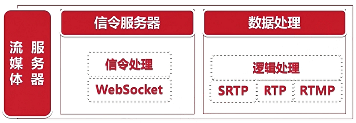
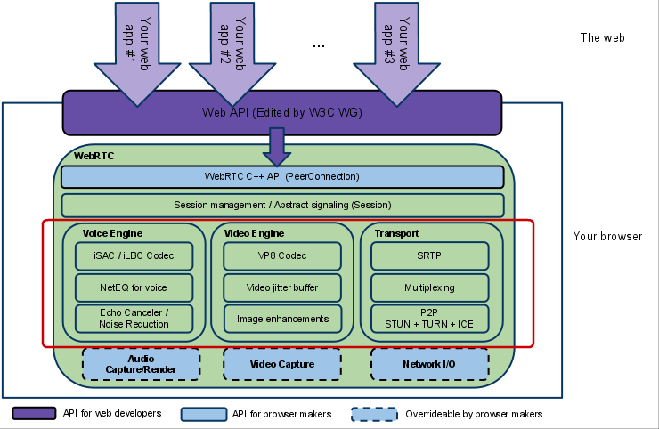

# WebRtc 初识

- [WebRtc 初识](#webrtc-初识)
  - [什么是 WebRtc](#什么是-webrtc)
  - [流媒体服务器](#流媒体服务器)
  - [WebRtc 架构](#webrtc-架构)
    - [WebRtc 架构组件](#webrtc-架构组件)
    - [模块细致讲解](#模块细致讲解)
  - [参考](#参考)

我们使用 webrtc 的主题要目的是应用它的 A/V 捕获、视频显示、音频播放、音视频压缩、网络通信。本文主要记录再应用程序中如何使用 webrtc 库。

## 什么是 WebRtc

WebRTC（Web Real-Time Communication）项目的最终目的主要是让 Web 开发者能够基于浏览器（Chrome\FireFox\…）轻易快捷开发出丰富的实时多媒体应用，而无需下载安装任何插件，Web 开发者也无需关注多媒体的数字信号处理过程，只需编写简单的 Javascript 程序即可实现。

- 特点：
  1. 跨平台。
  2. 实时传输。
  3. 音视频引擎。

- WebRtc 仅支持点对点功能，想要实现会议、直播等还需要流媒体服务器进行配合。

## 流媒体服务器

1. 信令服务器：处理用户功能逻辑。
2. 数据处理：通过数据处理结合信令进行分发。



## WebRtc 架构



- 架构图颜色标识说明：
  1. 紫色部分是 Web 开发者 API 层；
  2. 蓝色实线部分是面向浏览器厂商的 API 层；
  3. 蓝色虚线部分浏览器厂商可以自定义实现。

### WebRtc 架构组件

1. Your Web App：Web 开发者开发的程序，Web 开发者可以基于集成 WebRTC 的浏览器提供的 web API 开发基于视频、音频的实时通信应用。
2. Web API：面向第三方开发者的 WebRTC 标准 API（Javascript），使开发者能够容易地开发出类似于网络视频聊天的 web 应用。
3. WebRTC Native C++ API：本地 C++ API 层，使浏览器厂商容易实现 WebRTC 标准的 Web API，抽象地对数字信号过程进行处理。这一层的主要作用就是把 WebRtc 的核心功能暴露出来，如设备管理，音视频流数据采集等，方便各个软件厂商集成到自家应用中，比如浏览器厂商。其中 PeerConnection 是该层最核心的一个模块，即对等连接模块；该模块中实现了很多功能，如 P2P 穿洞、通信链路的建立和优选、流数据传输、非音视频数据传输、传输质量报告和统计等。
4. Transport / Session：传输/会话层，会话层组件采用了 libjingle 库的部分组件实现，无须使用 协议。XMPP/jingle 协议。
   - XMPP 协议：主要用于解决获取用户列表、交换用户数、信令交换。
   - RTP Stack 协议：Real Time Protocol。
   - STUN / ICE：可以通过 STUN 和 ICE 组件来建立不同类型网络间的呼叫连接。现实网络环境有三种情况：
     1. 公共网络：这类网络 IP 之间可以不受限制的进行直接访问。
     2. NAT 网络：这类网络主机在私有内网中，没有单独的公网 IP。但可以通过打洞来找到它在公网中固定的网络地址。STUN 协议就是解决些网络问题。
     3. 严格的受限 NAT 网络：这类网络中的主机在私网内，只能单向访问外网。外网不能直接访问它。所以这类网络需要通过在公共网络上的 TURN 服务器来进行数据中转。TURN 协议就是解决此网络问题的。
     4. 为了解决地址转换、防火墙限制访问等问题。所以提供了ICE 协议，ICE 协议是一个框架，它依赖 STUN 协议解决完全锥形 NAT、以及受限锥形 NAT。TURN 协议用于解决严格受限 NAT 网络的问题。
   - SessionManagement：一个抽象的会话层，提供会话建立和管理功能。该层协议留给应用开发者自定义实现。
5. VoiceEngine：音频引擎是包含一系列音频多媒体处理的框架，包括从视频采集卡到网络传输端等整个解决方案。
      - iSAC（Internet Speech Audio Codec）：针对 VoIP 和音频流的宽带和超宽带音频编解码器，是 WebRTC 音频引擎的默认的编解码器；

        ```bash
        采样频率：16khz，24khz，32khz；（默认为 16khz）
        自适应速率为 10kbit/s ~ 52kbit/；
        自适应包大小：30~60ms；
        算法延时：frame + 3ms
        ```

      - iLBC（Internet Low Bitrate Codec）：VoIP 音频流的窄带语音编解码器。

        ```bash
        采样频率：8khz；
        20ms 帧比特率为 15.2kbps
        30ms 帧比特率为 13.33kbps
        标准由 IETF RFC3951 和 RFC3952 定义
        ```

      - NetEQ for Voice：针对音频软件实现的语音信号处理元件
        - NetEQ 算法：自适应抖动控制算法以及语音包丢失隐藏算法。使其能够快速且高解析度地适应不断变化的网络环境，确保音质优美且缓冲延迟最小。是 GIPS 公司独步天下的技术，能够有效的处理由于网络抖动和语音包丢失时候对语音质量产生的影响。NetEQ 是 WebRTC 中一个极具价值的技术，对于提高 VoIP 质量有明显效果，加以 AEC\NR\AGC 等模块集成使用，效果更好。

      - AEC（Acoustic Echo Canceler）：回声消除器是一个基于软件的信号处理元件，能实时的去除 mic 采集到的回声。

      - NR（Noise Reduction）：噪声抑制也是一个基于软件的信号处理元件，用于消除与相关VoIP的某些类型的背景噪声（嘶嘶声，风扇噪音等等… …）。

      - Opus：持从 6 kbit/s 到 510 kbit/s 的恒定和可变比特率编码，帧大小从 2.5 ms 到 60 ms，各种采样率从 8 kHz（4 kHz 带宽）到 48 kHz（20 kHz带宽，可复制人类听觉系统的整个听力范围）。由 IETF RFC 6176 定义。

6. VideoEngine：WebRTC 视频处理引擎，其中包含了一系列视频处理的整体框架，从摄像头采集视频到视频信息网络传输再到视频显示整个完整过程的解决方案。
      - VP8：视频图像编解码器，是 WebRTC 视频引擎的默认的编解码器。VP8 适合实时通信应用场景，因为它主要是针对低延时而设计的编解码器。
        - VPx 编解码器是 Google 收购 ON2 公司后开源的，VPx 现在是 WebM 项目的一部分，而 WebM 项目是 Google 致力于推动的 HTML5 标准之一。
      - Video Jitter Buffer：视频抖动缓冲器，可以降低由于视频抖动和视频信息包丢失带来的不良影响。
      - Image enhancements：图像质量增强模块，对网络摄像头采集到的图像进行处理，包括明暗度检测、颜色增强、降噪处理等功能，用来提升视频质量。

### 模块细致讲解

WebRTC 有三个模块，Voice Engine（音频引擎），Video Engine（视频引擎），Transport。

- 第一个模块 Voice Engine， Voice Engine 是一个包含了系列音频处理功能的框架，如音频编解码、音频优化等。分别来陈述这几个功能：
  1. 编解码器，webrtc内置的音频编码器有iSAC、iLBC。iSAC是针对VoIP（Voice over Internet Protocol，即基于IP的语音传输）和音频流在宽带和超宽带环境中进行音频传输的编解码器 ，是WebRTC音频引擎的默认的编解码器，技术成熟，且被广泛应用在各种实时通信软件中，如Skype、QQ；iLBC则是VoIP在窄带环境中的语音编解码器，在网络丢包较为严重的情况下仍能保持较好通话质量，该编解码器应用广泛。
  2. NetEQ是网络语音信号处理的组件，其算法能自适应网络环境的变化，有效的处理因网络抖动而导致数据丢包所造成的音频质量问题，这一技术可谓是GIPS的看家本领，在webrtc中占据着至关重要的位置。
  3. Echo Canceler/Noise Reduction，Echo Canceler是处理回声消除模块，能有效的消除采集音频带来的回声影响；Noise Reduction是抑制噪音模块，如有效的抑制多种噪音（如嘶嘶声，风扇噪音等）。总而言之，在音频引擎中各种语音处理模块/组件都非常优秀，并且广泛在各类工程应用软件中。

- 第二个模块 Video Engine，Video Engine 是一个包含了系列视频处理功能的框架，如编码、防网络抖动、图像处理等。分别来陈述这几个功能：
  1. 编解码器，VP8是专为解决网络传输延时设计的视频编解码器，基于此编解码技术可以凭借更少的数据量得到更高的视频质量，其数据压缩率和性能方面比市场上其他编解码器高，其功能特点非常适合实时通信，是webrtc中默认的视频编解码器。
  2. Video Jitter Buffer：视频抖动缓冲器，实时视频通信难免会因为网络的原因导致视频的抖动或者视频数据的丢失，视频抖动缓冲器依靠独特的算法，有效的解决这类情况对视频质量造成的影响。
  3. Image enhancements：图像质量增强模块，本模是用来做图像处理以提升视频画面质量的，如图像明暗度检测、颜色增强、降噪处理等。

- 第三个模块 Transport，即数据传输模块。在 webrtc 中，数据传输除了音视频流数据之外，还可以传输文件、文本、图片等其他二进制数据。我们在使用 webrtc 底层开源代码时，完全可以根据需求有针对性的选择某些模块单独使用，比如单独选择传输模块来帮我们解决复杂的传输问题，我们无需考虑传输时的 P2P 链路搭建，链路优选，数据丢包重传等问题。接下来分别来陈述本模块的几个重要的功能：
  1. 传输协议，在 webrtc 中，底层传输协议基于 UDP（关于 UDP 和 TCP，请读者自行查阅资料），上层基于 RTP/SRTP 协议。RTP 是 (Real Time Protocol) 提供了具有实时特征的、端到端的数据传送服务协议，适用于传输声音，图像数据，更多关于RTP协议的资料可以自行查阅。但在 RTP 中，并未考虑到数据传输的安全性，所以不符合安全性要求较高的应用需求，为了解决此问题，SRTP 应运而生。SRTP(SecureReal-time Transport Protocol) 是在 RTP 的基础上加入了安全机制的传输协议，SRTP 为数据提供了加密、消息认证、完整性保证和重放保护等功能，最大程度保障了数据传输的安全性。注意，RTP/SRTP 协议本身并不能保证传输质量，即数据传输过程中丢失是很常见的。传输质量由下层的网络质量决定，但即使网络质量能保证足够好，RTP/SRTP 也不能保证数据包的按顺序到达，于是引入了 RTCP/SRTCP，即 RTP 控制协议（RTP Control Protocol），该协议用于数据传输时的服务质量监视与反馈、媒体间同步，以及多播组中成员的标识，一句话来讲就是监控 RTP 传输的质量，例如数据发送端或者接收端通过 RTCP 数据检测此刻网络传输的效果不理想，丢包率较高，发送端和接收端会自动调整收发数据包的速率，必要的情况下还会更换通信链路，以此来尽可能的提高传输质量。SRTCP 如同 SRTP一样，属于对应协议的加密版，这里不在赘述。
  2. Multiple exing，通道复用，即多个流数据传输共用一个通道， 以此提高传输效率。
  3. P2P 相关技术，实现 P2P 通信需要用到这些技术：STUN、TURN、ICE。

## 参考

《WebRtc 零基础开发教程》
