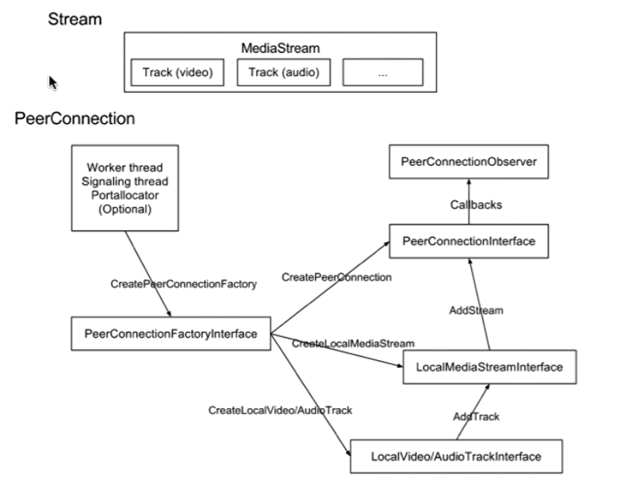
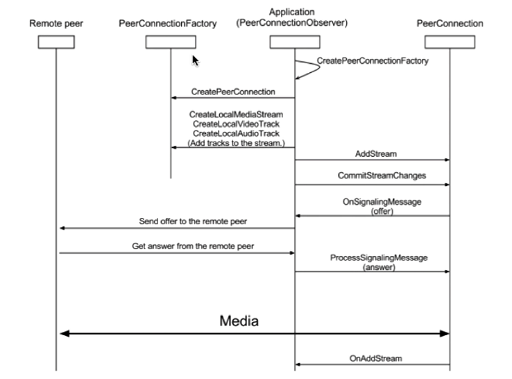

# WebRtc 开发基础

- [WebRtc 开发基础](#webrtc-开发基础)
  - [WebRtc 源码结构](#webrtc-源码结构)
  - [WebRtc 核心模块 API](#webrtc-核心模块-api)
    - [WebRtc 重要的类](#webrtc-重要的类)
    - [libjingle 网络传输模块](#libjingle-网络传输模块)
    - [WebRtc Native C++ API](#webrtc-native-c-api)

## WebRtc 源码结构

1. [api](../LibWebRtcUsingExample/Include/api)：该目录存放了 WebRTC 接口层的代码，即核心层中的 WebRTC C++ API，浏览器厂商或者其他软件开发者可以在此调用或者调整 WebRTC API。
2. [call](../LibWebRtcUsingExample/Include/call)：该目录存放数据流管理逻辑代码，即主要**处理与流数据相关的业务**，这里的流数据主要指流媒体。
   - call 代表的是同一个端的流数据的流入流出，比如 A 和 B 进行音视频通话，在 A 中会生成一个 call，本次通话所有音视频流都在这个 call 里。由此可知，在 call 里管理通话双方的流数据，可以获取通话过程中的各种统计数据。同理，B 也是如此。如果 A 再和 C 通信，那么 A 中会再次创建一个新 call。与一端建立通信都会建立一个 call。
3. [video](../LibWebRtcUsingExample/Include/video)：存放视频处理相关的业务。如视频编解码，视频数据优化处理等。video 目录就是视频处理逻辑代码的总入口。
4. [audio](../LibWebRtcUsingExample/Include/audio)：如同 video，只是这里处理的是音频数据。
5. [common_video](../LibWebRtcUsingExample/Include/common_video)：视频算法相关的代码，在视频处理中，算法是一个大技术内容，所以 webrtc 单独把算法的业务分出来。
6. [common_audio](../LibWebRtcUsingExample/Include/common_audio)：如同 common_video，这里存放的是处理的音频数据的算法文件。
7. [media](../LibWebRtcUsingExample/Include/media)：多媒体处理相关的逻辑。如判断处理音频视频时什么时候使用编解码。注意，真正的编解码代码没有放在这里。
8. [logging](../LibWebRtcUsingExample/Include/logging)：存放日志处理的相关代码。
9. [module](../LibWebRtcUsingExample/Include/modules)：这个目录就稍微复杂些，里面存放各种子模块，下面具体分析。
    1. module/[audio_coding](../LibWebRtcUsingExample/Include/modules/audio_coding)：存放了音频编解码器相关的代码，如 AAC、iSAC、iLBC 等音频编解码器。
    2. module/[audio_device](../LibWebRtcUsingExample/Include/modules/audio_device)：存放了音频采集和播放相关代码。
    3. module/[audio_mixer](../LibWebRtcUsingExample/Include/modules/audio_mixer)：存放混音相关的代码，比如音视频通信时，同时有多个人讲话，为了方便传输和管理，会把多路声音混在一起统一传输。
    4. module/[audio_processing](../LibWebRtcUsingExample/Include/modules/audio_processing)：存放音频前处理和后处理的相关代码，人音频的降噪、回音消除等。
    5. module/[bitrate_controller](../LibWebRtcUsingExample/Include/modules/bitrate_controller)：存放码率控制的相关代码，在音频中码率就是比特率，表示的是音频从模拟信号转成数字信号之后，单位时间内二进制的数量，码率越高表示声音衔接越流畅，当然数据量也越大。
    6. module/[congestion_controller](../LibWebRtcUsingExample/Include/modules/congestion_controller)：存放流量控制的代码，在音视频通信时，为了保护带宽，需要做流量控制。
    7. module/[desktop_capture](../LibWebRtcUsingExample/Include/modules/desktop_capture)：存放桌面采集的相关代码，通过桌面采集的功能可以实现远程桌面共享。
    8. module/[pacing](../LibWebRtcUsingExample/Include/modules/pacing)：存放码流监测以及传输平滑处理。每个音视频流的码率有高有低，发送的速率不能太高或者太低，需要做折中的处理，使得传输数据上更加的平滑。
    9. module/[remote_bitrate_estimator](../LibWebRtcUsingExample/Include/modules/remote_bitrate_estimator)：存放远端码率评估代码。通信是双方相互兼容，本地发送的码率和远端能接收的码率要匹配才能达到较好的通信效果，例如远端能接收的码率为 50k，本地不能发 500k 码率的数据，远程接收的速率没这么快，会导致通信的不流畅，于是在传输之前，数据发送端会先检测远端接收端的情况再发送。
    10. module/[rtp_rtcp](../LibWebRtcUsingExample/Include/modules/rtp_rtcp)：存放 rtp、rtcp 协议相关的代码，关于这两个协议在之前的文章中解释过了，这里不在赘述。
    11. module/[video_capture](../LibWebRtcUsingExample/Include/modules/video_capture)：存放视频采集相关的代码。
    12. module/[video_coding](../LibWebRtcUsingExample/Include/modules/video_coding)：存放视频编解码器相关的代码，如 H264、VP8、VP9 等。
    13. module/[video_processing](../LibWebRtcUsingExample/Include/modules/video_processing)：存放视频前处理、后处理的相关代码，如视频图像的增强，视频帧的处理，如果需要添加其他图像处理功能，可以在该目录中扩展。
10. [pc](../LibWebRtcUsingExample/Include/pc)：这个目录存放了了 PeerConnection 的代码，即连接逻辑。上一节讲 WebRtc 架构时在 WebRTC C++ API 层提到过 PeerConnection 的概念，在这里再讲下，在通信前期首先要创建连接对象，即 PeerConnection 对象，然后通过往该连接对象加入流就可以实现音视频的通信，至于传输的细节都在 PeerConnection 内完成了。此外还可以通过该对象获取到传输的流信息，传输时各种统计数据。
11. [p2p](../LibWebRtcUsingExample/Include/p2p)：p2p 就不再解释了，本目录下存放所有 p2p 连接相关的所有逻辑代码，比较重要的技术如 STUN、TURN。
12. [rtc_base](../LibWebRtcUsingExample/Include/rtc_base)：存放基础代码目录，如线程管理操作，锁管理等跨平台适配代码。
13. [rtc_tool](../LibWebRtcUsingExample/Include/rtc_tools)：这里存放音视频分析工具的相关代码。
14. tool_webrtc：这里存放 webrtc 测试的相关工具代码，如网络模拟测试。(此部分详见 WebRtc 源码，头文件不包含)
15. [system_wrappers](../LibWebRtcUsingExample/Include/system_wrappers)：这里存放了与操作系统相关的代码，如 CPU 特性、原则操作等。
16. [stats](../LibWebRtcUsingExample/Include/stats)：存放各种统计相关的代码，如丢包率统计，抖动时长等。
17. [sdk](../LibWebRtcUsingExample/Include/sdk)：存放了 Android、IOS 层相关的代码，如音视频采集、渲染等。方便跨平台开发。

## WebRtc 核心模块 API

### WebRtc 重要的类

1. MediaStream：流数据控制实现。
2. RTCPeerConnection：链接功能大类，包含所有的网络传输等逻辑。
3. RTCDataChannel：非音视频数据传输实现。

### libjingle 网络传输模块

WebRTC 重用了 libjingle 的一些组件，主要是 network 和 transport 组件，关于 libjingle 的文档资料可以查看[这里](https://developers.google.com/talk/talk_developers_home)。

### WebRtc Native C++ API

- PeerConnection 调用过程： API:src/api/peer_connection_interface.h

    

  1. 首先 MediaStream 中包含很多音视频轨。
  2. 下边就是 PeerConnection ，其中由两个线程。Worker thread 和 Signaling thread。
  3. 创建 peerConnection 工厂实现不同功能：PeerConnectionInterface、LocalMediaStreamInterface、LocalVideo/AudioTrackInterface。
  4. 使用流程就是先通过 LocalVideo/AudioTrackInterface 创建音视频轨，通过 AddTrack 添加到 LocalMediaStreamInterface，然后通过 AddStream 添加到 PeerConnectionInterface 中，最终通过 CallBack 发送出去。

调用时序图如下：

