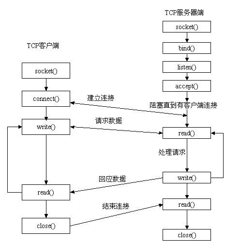
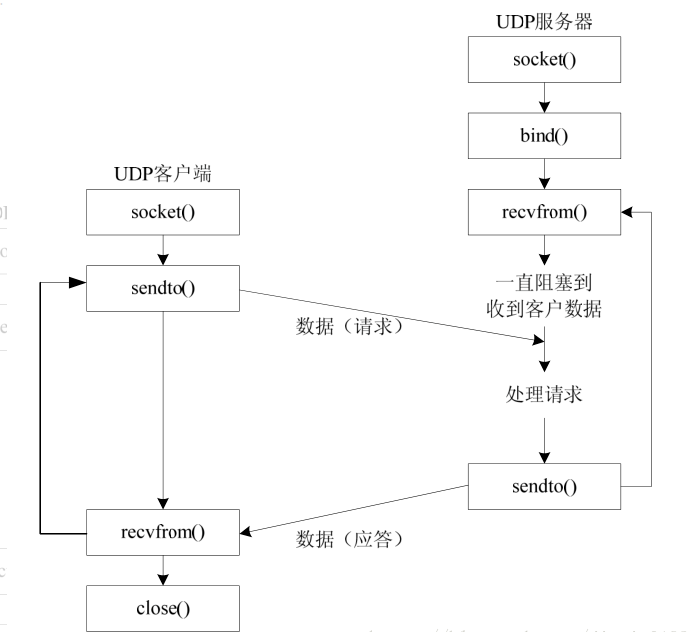

# 网络编程

- [网络编程](#网络编程)
  - [处理信号](#处理信号)
    - [重要的信号](#重要的信号)
  - [发送信号](#发送信号)
  - [信号处理（安装信号）](#信号处理安装信号)
  - [后台服务](#后台服务)
    - [创建后台进程](#创建后台进程)
  - [TCP 通信](#tcp-通信)
  - [UDP 通信](#udp-通信)
  - [高性能网络服务器](#高性能网络服务器)
    - [fork 的方式实现](#fork-的方式实现)
    - [select 的实现方式](#select-的实现方式)
    - [epoll 的实现方式](#epoll-的实现方式)
  - [异步事件处理库](#异步事件处理库)
    - [libevent 重要函数](#libevent-重要函数)

## 处理信号

信号处理方式：忽略、捕获、默认处理。

- 大多数信号默认处理都是简单的杀死进程，服务器程序需要控制信号，避免误杀。
- 查看信号：man 7 signal

### 重要的信号

1. SIGPIPE 管道终止，当写入无人读物的管道时产生该信号，默认终止进程。
2. SIGCHLD 子进程结束或停止时发送。
3. SIGALRM 定时器信号，以秒为单位，默认终止进程。
4. SIGUSR1/SIGUSR2 自定义，默认终止进程。
5. SIGINT  键盘输入的退出信号。
6. SIGQUIT 键盘输入的退出信号，默认会生成 core。
7. SIGHUP 控制终端的挂起信号。

- 重点：
  1. 网络程序必须要处理 SIGPIPE 信号，否则当客户端退出后，服务器仍然向该 SOCKET 发数据时，会引起 Crash。
  2. SIGCHLD 僵尸进程是一个早已死亡的进程，但在进程表仍占有位置。这是由于 Linux 中当子进程结束后，父进程没有处理 SIGCHILD 信号并且没有 wait / waitpid，导致子进程没有完全释放。

## 发送信号

1. 硬件方式：如 `<C-c>`、`<C-\>` 等。
2. 命令方式：kill -no api。

## 信号处理（安装信号）

1. 简单方式：

    ```cpp
    #include <signal.h>

    typedef void (*sighandler_t)(int);

    sighandler_t signal(int signum, sighandler_t handler);
    ```

2. 高级方式：

    ```cpp
    #include <signal.h>

    int sigaction(int signum, const struct sigaction *act,
                     struct sigaction *oldact);

    Feature Test Macro Requirements for glibc (see feature_test_macros(7)):

    sigaction(): _POSIX_C_SOURCE

    siginfo_t: _POSIX_C_SOURCE >= 199309L
    ```

## 后台服务

### 创建后台进程

1. fork 的方式：
    - fork 创建一个子进程，然后父进程退出使得子进程称为孤儿进程，被 Init 进程接管。
    - 调用 setsid 建立新的进程会话。
    - 将当前工作目录切换到根目录。
    - 将标准输入、输出、出错重定向到 /dev/null。

        ```cpp
        /**
        * 注释1：因为我们从shell创建的daemon子进程，所以daemon子进程会继承shell的umask，如果不清除的话，会导致daemon进程创建文件时屏蔽某些权限。
        * 注释2：fork后让父进程退出，子进程获得新的pid，肯定不为进程组组长，这是setsid前提。
        * 注释3：调用setsid来创建新的进程会话。这使得daemon进程成为会话首进程，脱离和terminal的关联。
        * 注释4：最好在这里再次fork。这样使得daemon进程不再是会话首进程，那么永远没有机会获得控制终端。如果这里不fork的话，会话首进程依然可能打开控制终端。
        * 注释5：将当前工作目录切换到根目录。父进程继承过来的当前目录可能mount在一个文件系统上，如果不切换到根目录，那么这个文件系统不允许unmount。
        * 注释6：在子进程中关闭从父进程中继承过来的那些不需要的文件描述符。可以通过_SC_OPEN_MAX来判断最高文件描述符(不是很必须).
        * 注释7：打开/dev/null复制到0,1,2，因为dameon进程已经和terminal脱离了，所以需要重新定向标准输入，标准输出和标准错误(不是很必须).
        */
        void daemonize(){
            int fd0;
            pid_t pid;

            /* * Become a session leader to lose controlling TTY. */
            if ((pid = fork()) < 0) {//注释2
                printf("can't fork \n");
                exit(-1);
            }
            else if (pid != 0) /* parent */
                exit(0);

            setsid();//注释3

            if (chdir("/") < 0) {//注释5
                printf("can't change directory to / \n");
                exit(-1);
            }

            fd0 = open("/dev/null", O_RDWR);//注释7
            dup2(fd0, STDIN_FILENO);
            dup2(fd0, STDOUT_FILENO);
            dup2(fd0, STDERR_FILENO);
        }
        ```

2. deamon 的方式：

    ```cpp
    //0 改变目录 0 改变出错重定向
    if(daemon(0,0) == -1)
        exit(EXIT_FAILURE);
    ```

## TCP 通信



[详见 APUE 笔记十六章](https://github.com/HATTER-LONG/NoteBook_APUE3/blob/master/16-%E7%BD%91%E7%BB%9C%E5%A5%97%E6%8E%A5%E5%AD%97IPC/16.md)。

## UDP 通信

1. UDP Server 网络编程基本步骤：
   - 创建 socket，指定使用 UDP 协议。
   - 将 socket 与地址和端口帮等。
   - 使用 recv/send 接受/发送数据。
   - 使用 close 关闭。



## 高性能网络服务器

[详见 APUE 笔记十四章](https://github.com/HATTER-LONG/NoteBook_APUE3/blob/master/14-%E9%AB%98%E7%BA%A7IO/14.md)

1. 通过 fork 实现高性能服务器：使得每个客户都有一个服务端的进程进行服务。
2. 通过 select 实现：通过 IO 复用实现。
3. 通过 epoll 实现：推荐。
4. 利用 I/O 时间处理库来实现高性能网络服务器。

### fork 的方式实现

- 每收到一个链接就创建一个子进程。
- 父进程负责接受链接。
- 通过 fork 创建子进程。

带来的问题：

- 资源被长期占用。
- 分配子进程花费时间长。

### select 的实现方式

- select 使用异步 IO 以事件触发的机制来对 IO 操作进行处理。与多线程和多线程技术相比，异步 IO 最大的有时是系统开销下，系统不必创建进程/线程，也不必维护这些进程/线程，从而减少了消耗。
- select 是一种半自动模式，需要遍历文件描述符集中所有的描述符，找出有变化的描述符。
- 对于侦听的 socket 和 数据处理的 socket 要区别对待。
- socket 必须设置为非阻塞工作。

### epoll 的实现方式

1. 没有文件描述符的限制。
2. 工作效率不会随着文件描述符的增加而下降。
3. Epoll 经过系统优化更高效。

- 事件触发模式：
  - Level Trigger 没有处理反复发送。
  - Edge Trigger 只发送一次。

- Epoll 重要 API:
  - epoll_create() 参数无意义。
  - epoll_ctl() 通过 epoll 管理。
  - epoll_wait() 等待 就绪 的 fd。

## 异步事件处理库

- libevent：网络事件处理。
- libevthp：基于 libevent 实现 Http 服务。
- libuv：Node.js 使用。
- libev：比较老的架构。

### libevent 重要函数

- event_base_new：类似创建一个 epoll_create 的一个实例，以及 libevent 所有的事件管理代码。
- event_base_dispatch：类似于 epoll_wait。
- event_new & event_add & event_del & event_free ： 组成了 epoll_ctl。

更高层的 API：

- evconnlistener_new_bind：混合接口。

- bufferevent：带事件的缓冲区，可以与 socket 进行绑定。内部由两个缓冲区组成输入、输出。每一个 socket 对应一个 bufferevent。当 socket 有事件触发时，可以设置回调函数。

