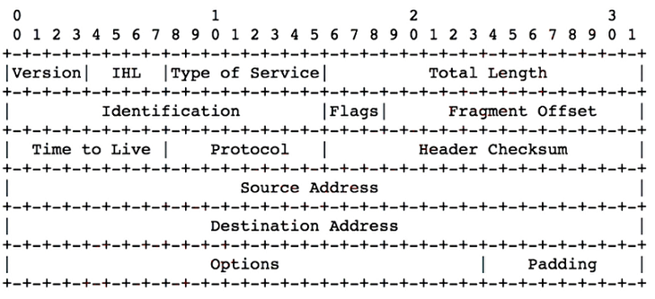
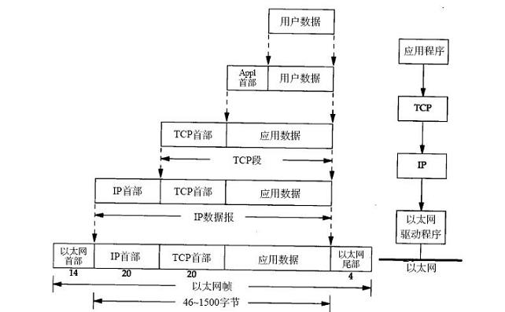
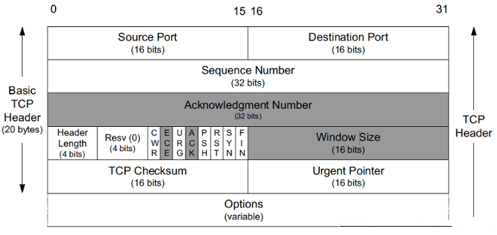
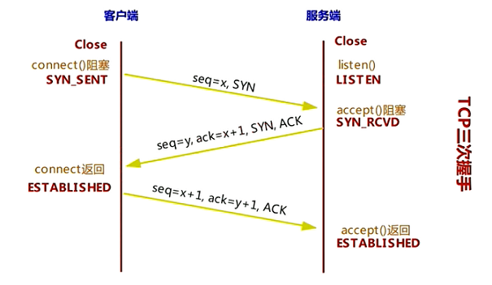
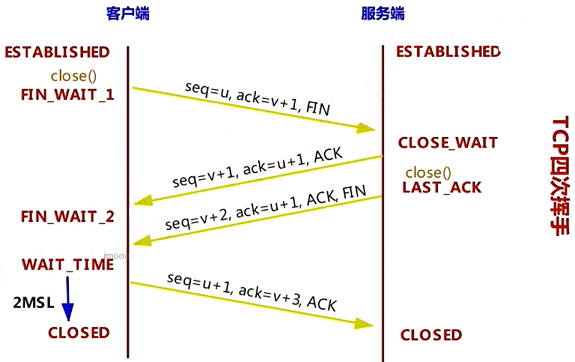
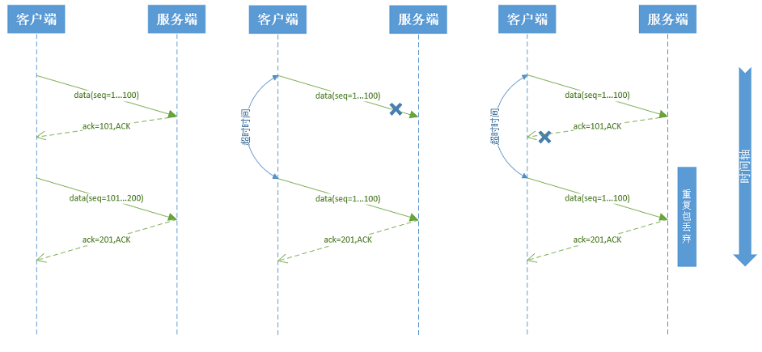
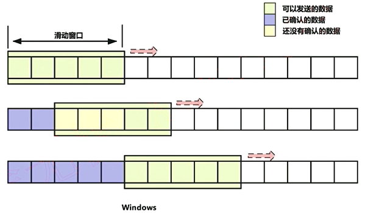
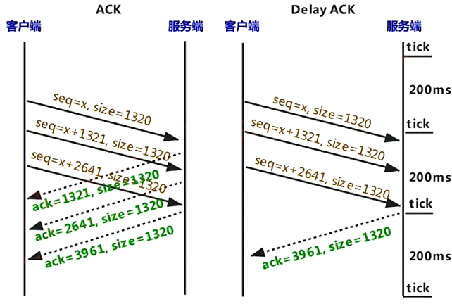

# 网络协议

- [网络协议](#网络协议)
  - [IP 协议头](#ip-协议头)
    - [MTU](#mtu)
  - [TCP/IP 协议栈](#tcpip-协议栈)
    - [TCP 协议头](#tcp-协议头)
    - [TCP 三次握手](#tcp-三次握手)
    - [TCP 四次挥手](#tcp-四次挥手)
    - [TCP 的 ACK 机制](#tcp-的-ack-机制)
    - [TCP 的滑动窗口](#tcp-的滑动窗口)
    - [Delay ACK](#delay-ack)
    - [TCP 总结](#tcp-总结)
  - [UDP 与 RTP](#udp-与-rtp)
    - [UPD 协议](#upd-协议)
    - [RTP](#rtp)
  - [实时传输 TCP/UDP 协议的选择](#实时传输-tcpudp-协议的选择)
    - [TCP 在实时通信中的使用](#tcp-在实时通信中的使用)

## IP 协议头

协议头是所有基础网络协议必不可少的，下图显示了 IP 协议头数据结构：



- 基本信息
  1. Version：版本。
  2. IHL：IP 头数据长度。
  3. Total Length：总数居长度。与 IHL 相减就可以得出数据长度。

- 拆包相关（一般网络数据包为 1500 byte 超过后就需要拆包），后续组包就需要以下参数：
  1. Identification：唯一标识，归类那些包需要租在一起。
  2. Flags：三位，分为标识允许拆包、不允许拆包、保留。
  3. Fragment Offset：组包时，每个数据包的偏移量是多少。

- 路由信息：
  1. Time to Live：TTL，一般指路由跳数。
  2. Protocol：数据类型 TCP、UDP、SMP、其他路由协议等等。
  3. Header Checksum：校验和。

- 源与目的信息：
  1. Source Address：源地址。
  2. Destination Address：目的地址。
  3. Options：设置项。
  4. Padding：32 为字节对其。

### MTU

Maximum Transmission Unit，指在网上可传输数据的最大尺寸。可通过 **ICMP** 查询最大传输单元。它通过设置 IP 层的 DF（Don't Fragment）不分片位，如果将这一比特设置位 1，IP 层将不对数据包进行分片。获得 MTU 的好处就是最大化设备包得大小，避免拆包获得传输效率。

## [TCP/IP 协议栈](https://www.cnblogs.com/onepixel/p/7092302.html)

具体可以看互联网协议基础一节。



### TCP 协议头



- 确定目标指定服务地址端口：
  1. Source Port：源端口。
  2. Destination Port：目的端口。

- TCP 有序需要的编号：
  1. Sequence Number：给数据包排序、确认是否丢失。这个包的序号是按照包数据长度字节来的。每个包的 Seq Number 代表的时发送字节的起始序号。发送的第一个包的初始序号时随机的，在创建链接三次握手过程中交换。

- TCP 可靠性需要的 Ack 编号：
  1. Acknowledgment Number：目标地址收到数据包后回复的 Ack 应答包编号。代表的时希望对方发送数据的起始位置。A 向 B 发送一个数据包，SeqNUmber 为 1000，大小为 1000 字节，则 B 收到该包后，返回的 Ack Number 为 2001。

- 定位 TCP 数据端：
  1. Data Offset：由于 Options 是动态变化的，想要定位到数据段需要 offset 偏移。

- 保留字段 Reserved。

- 标识位：
  1. ACK：目的主机应答标识。
  2. PSH：发送数据需要置位负载数据。
  3. RST：复位标志位，当目标地址端口未提供服务或链接有问题会回复这个标志位。
  4. SYN：TCP 链接建立的三次握手时，每次交互都要设置 SYN，标识握手协议。
  5. FIN：TCP 四次挥手需要的 FIN 标识。
  6. URG：紧急数据标识。

- 发送数据时每次可以发送多少包数据：
  1. Window：指定两端协商后的缓冲大小。

- 校验和 CheckSum。
- 紧急指针：与 URG 匹配。
- Options：一些设置选项。例如报文长度等等。

### TCP 三次握手

经典的 TCP 三次握手后建立链接：



### TCP 四次挥手

当双方想断开连接时的协议交互，2MSL 时间的等待主要是为了保证结束的 ACK 应答能发送到对端：



WAIT_TIME TCP 连接中谁主动关闭链接，谁就会处于 WAIT_TIME，2 倍的 MSL。作用是保证 服务端可以是偶到 ACK，服务端如果收不到 ACK 就会一直发之前的 FIN。MSL 最大两分钟。

### TCP 的 ACK 机制



### TCP 的滑动窗口

当 TCP 三次握手完成后，首先要进行的就是窗口确认，也就是发送端与接收端缓冲区大小确认。TCP 是一次发送整个窗口的数据量，随着接收端 ACK 应答，窗口向后边还没有发送的数据滑动。

1. 当前滑动窗口前两个数据收到 ACK 应答，窗口向后滑两格。
2. 当前滑动窗口后两个数据收到 ACK 应答，不能向后滑动，因为无法判断窗口前边数据是否成功接受要考虑重发机制，因此需要等待前边数据的 ACK 后才能向后滑动。



### Delay ACK

加入了滑动窗口后，ACK 应答是有变化的，并不是每一次收到数据都会立即 ACK 应答，为了节省带宽，而是有一个延时应答。接收端有一个定时器，当收到的数据包在同一个定时器区间就会在定时器超时后才进行 ACK 应答，而且 ACK 中信息包含了所有的接收到的数据信息。ACK 带的 size 表示，这个 ACK 还可能使服务端给客户端携带着数据。



### TCP 总结

首先进行握手：

1. win：确认窗口大小。
2. MSS：最大报文长度。最大报文段长度（MSS）是 TCP 协议的一个选项，用于在 TCP 连接建立时，收发双方协商通信时每一个报文段所能承载的最大数据长度（不包括文段头）。
3. seq num 确认。


## UDP 与 RTP

### UPD 协议

UPD 协议头如下，其中 Length 长度包括了 Header 和 Data。Udp 的头长度是固定的，剪掉头长度就是数据长。：


> 流媒体大多使用 UPD 协议，UPD 可靠性并不如 TCP，但是由于协议简单且不关注可靠性以及时序性，但是它的速度快很多。对于流媒体数据，实时性很需要传输速度，同时由于流媒体文件数据特点，丢失一些数据帧仅会导致数据卡顿，不会影响整体功能。

### RTP

RTP 是基于 UDP 或者 TCP 之上的协议。详情可以参考[这篇文章](https://cloud.tencent.com/developer/article/1747045)。

RTP 头数据格式如下：


- PT：区分格式。
- |M|：标记，例如对于视频这个 |M| 为 1。标识这时帧的最后一个包。
- CC：CSRC 的个数。
- |X|：扩展位。TLV 格式。
- |P|：填充位。
- |V|：Version 版本。

1. sequence number：和 TCP 类似的对于数据包排序用的标识，区别是 RTP 是以数据包的数量来当作编号（包式），而不是 TCP 的传输数据长度（流式）。
2. timestamp：时间戳。当传输数据一个包保存的数据比较多分了很多包，如何保证这些拆分的包属于一组数据，就是通过 timestamp 同一时刻。
3. SSRC：每一个发送者都有唯一的 SSRC。占 32 位，用于标识同步信源。该标识符是随机选择的，参加同一视频会议的两个同步信源不能有相同的 SSRC。
4. CSRC：共享源。每个 CSRC 标识符占 32 位，可以有 0～15 个。每个 CSRC 标识了包含在该 RTP 报文有效载荷中的所有特约信源。

    ```shell
    这里的同步信源是指产生媒体流的信源，例如麦克风、摄像机、RTP 混合器等；它通过 RTP 报头中的一个 32 位数字 SSRC 标识符来标识，而不依赖于网络地址，接收者将根据 SSRC 标识符来区分不同的信源，进行 RTP 报文的分组。

    特约信源是指当混合器接收到一个或多个同步信源的 RTP 报文后，经过混合处理产生一个新的组合 RTP 报文，并把混合器作为组合 RTP 报文的 SSRC，而将原来所有的 SSRC 都作为 CSRC 传送给接收者，使接收者知道组成组合报文的各个 SSRC。

    若一个 RTP 包流的源，对由 RTP 混频器生成的组合流起了作用，则它就是一个作用源。对特定包的生成起作用的源，其 SSRC 标识符组成的列表，被混频器插入到包的 RTP 报头中。这个列表叫做 CSRC 表。
    ```

## 实时传输 TCP/UDP 协议的选择

做网络音视频开发最主要保证的点：

1. 视频画面平滑稳定，清晰度高。
2. 音频流畅清晰。

问题：网络质量波动，层次不齐。

1. TCP：协议的优点，稳定、可靠。缺点，网络差造成丢包超时重传导致断连、并且**实时性不好**。
2. UDP：UDP 协议速度块，但是需要解决 UDP 传出不稳定可靠的问题，这就是需要 webrtc 的原因，它在 UDP 的协议基础上已经实现了这些功能。

### TCP 在实时通信中的使用

1. TCP 用于实时通信的情况主要在于 UDP 无法联通的情况时。**这就是连通率**。
2. 在使用 TCP 不通的情况，使用 HTTPS 来尝试。
