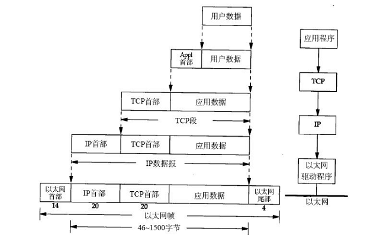
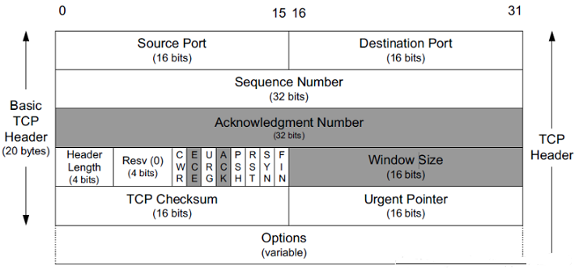

# 网络协议

- [网络协议](#网络协议)
  - [IP 协议头](#ip-协议头)
    - [MTU](#mtu)
  - [TCP/IP 协议栈](#tcpip-协议栈)
    - [TCP 协议头](#tcp-协议头)
  - [TCP 三次握手](#tcp-三次握手)
  - [TCP 四次挥手](#tcp-四次挥手)

## IP 协议头

协议头是所有基础网络协议必不可少的，下图显示了 IP 协议头数据结构：

- 基本信息
  1. Version：版本。
  2. IHL：IP 头数据长度。
  3. Total Length：总数居长度。与 IHL 相减就可以得出数据长度。

- 拆包相关（一般网络数据包为 1500 byte 超过后就需要拆包），后续组包就需要以下参数：
  1. Identification：唯一标识，归类那些包需要租在一起。
  2. Flags：三位，分为标识允许拆包、不允许拆包、保留。
  3. Fragment Offset：组包时，每个数据包的偏移量是多少。

- 路由信息：
  1. Time to Live：TTL，一般指路由跳数。
  2. Protocol：数据类型 TCP、UDP、SMP、其他路由协议等等。
  3. Header Checksum：校验和。

- 源与目的信息：
  1. Source Address：源地址。
  2. Destination Address：目的地址。
  3. Options：设置项。
  4. Padding：32 为字节对其。

### MTU

Maximum Transmission Unit，指在网上可传输数据的最大尺寸。可通过 **ICMP** 查询最大传输单元。它通过设置 IP 层的 DF（Don't Fragment）不分片位，如果将这一比特设置位 1，IP 层将不对数据包进行分片。获得 MTU 的好处就是最大化设备包得大小，避免拆包获得传输效率。

## [TCP/IP 协议栈](https://www.cnblogs.com/onepixel/p/7092302.html)

具体可以看互联网协议基础一节。

### TCP 协议头

- 确定目标指定服务地址端口：
  1. Source Port：源端口。
  2. Destination Port：目的端口。

- TCP 有序需要的编号：
  1. Sequence Number：给数据包排序、确认是否丢失。这个包的序号是按照包数据长度字节来的。每个包的 Seq Number 代表的时发送字节的起始序号。发送的第一个包的初始序号时随机的，在创建链接三次握手过程中交换。

- TCP 可靠性需要的 Ack 编号：
  1. Acknowledgment Number：目标地址收到数据包后回复的 Ack 应答包编号。代表的时希望对方发送数据的起始位置。A 向 B 发送一个数据包，SeqNUmber 为 1000，大小为 1000 字节，则 B 收到该包后，返回的 Ack Number 为 2001。

- 定位 TCP 数据端：
  1. Data Offset：由于 Options 是动态变化的，想要定位到数据段需要 offset 偏移。

- 保留字段 Reserved。

- 标识位：
  1. ACK：目的主机应答标识。
  2. PSH：发送数据需要置位负载数据。
  3. RST：复位标志位，当目标地址端口未提供服务或链接有问题会回复这个标志位。
  4. SYN：TCP 链接建立的三次握手时，每次交互都要设置 SYN，标识握手协议。
  5. FIN：TCP 四次挥手需要的 FIN 标识。
  6. URG：紧急数据标识。

- 发送数据时每次可以发送多少包数据：
  1. Window：指定两端协商后的缓冲大小。

- 校验和 CheckSum。
- 紧急指针：与 URG 匹配。
- Options：一些设置选项。例如报文长度等等。

## TCP 三次握手

经典的 TCP 三次握手后建立链接：

## TCP 四次挥手

当双方想断开连接时的协议交互，2MSL 时间的等待主要是为了保证结束的 ACK 应答能发送到对端：

