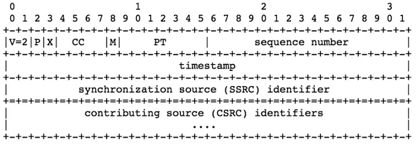
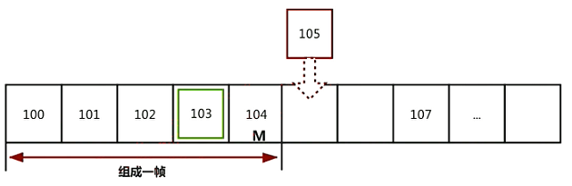
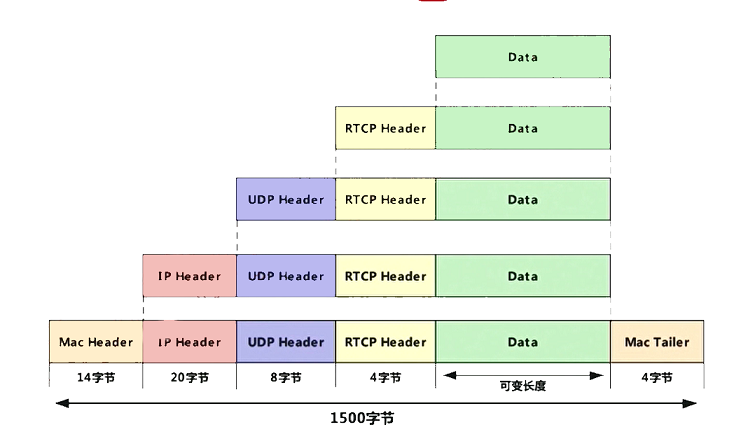
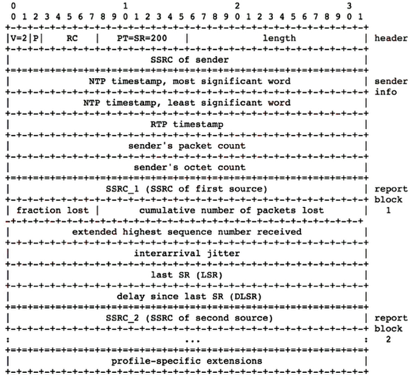
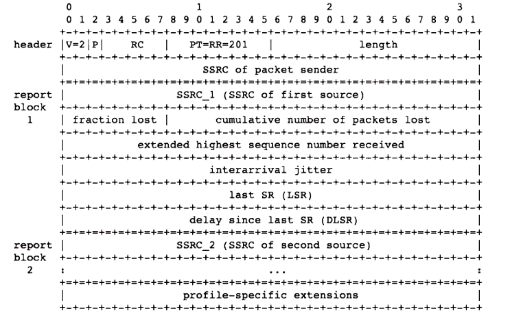
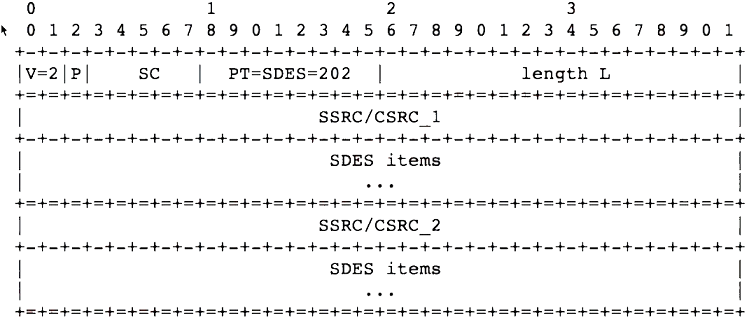
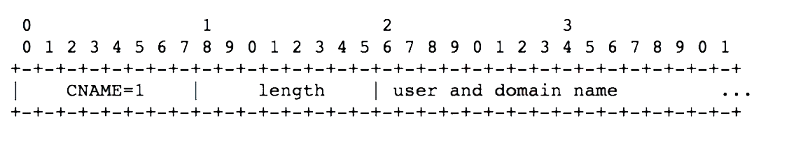
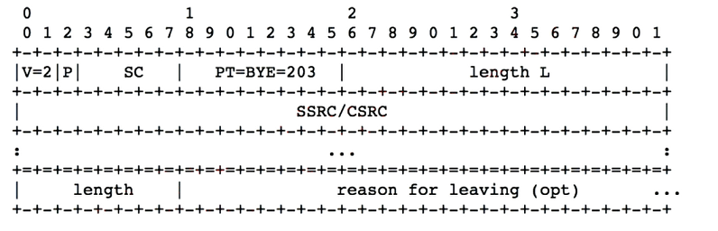
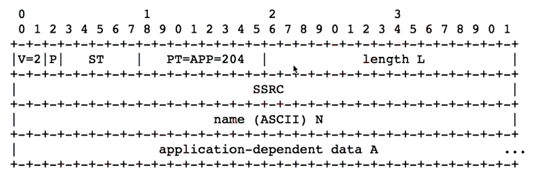
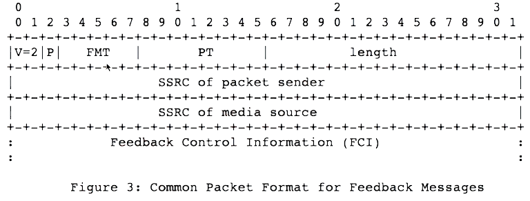

# 网络协议详解

- [网络协议详解](#网络协议详解)
  - [RTP 协议](#rtp-协议)
  - [RTCP 协议](#rtcp-协议)
    - [RTCP Type（PT）](#rtcp-typept)
    - [RTCP SR](#rtcp-sr)
    - [RTCP RR](#rtcp-rr)
    - [RTCP SDES](#rtcp-sdes)
    - [RTCP BYE](#rtcp-bye)
    - [RTCP APP](#rtcp-app)
    - [RTCP FB Type](#rtcp-fb-type)
    - [RTCP FB Header](#rtcp-fb-header)

## RTP 协议

前边已经介绍了 RTP 包头的格式信息：



RTP 包的使用，可以用于传输音频或者视频。对于视频尤其时 I 帧，可能会由几个几十个 RTP 包组成，需要将这些包组合起来还原成一帧数据在传出去。

RTP 接收端会有一个缓冲队列，会根据 seq num 来进行排序，如下图。当判断 104 为帧尾 |M|，判断 100 为 NALU 对应的 Slice 为一帧的开始，则用 4 字节表示，即 0x00000001；否则用 3 字节表示，0x000001。 这样就判断出一帧所需的包数据。



## RTCP 协议

RTP 协议的控制协议，RTCP 单独运行在低层协议上，由低层协议提供数据与控制包的复用。在 RTP 会话期间，每个会话参与者周期性地向所有其他参与者发送 RTCP 控制信息包，如下是 RTCP/RTP 包在网络包中的层级（rfc3550）。



RTCP Header 如下：

- Version：版本号。
- p：填充位。如果该位置位，则该包的尾部就包含附加的填充字节（包含自己）。
- RC：5 位，这个不仅仅是 RC（数据包数量），它是根据 PT 类型不同标识的含义也不同，。
- PT：8 比特，数据包类型。
- length：长度（包含头部）
- 后续数据

```shell
    2bit 1   5bit          8bit                16bit
  +-+-+-+-+-+-+-+-+-+-+-+-+-+-+-+-+-+-+-+-+-+-+-+-+-+-+-+-+-+-+-+-+
    |V=2|P|  RC     |       PT      |          length             |
  +-+-+-+-+-+-+-+-+-+-+-+-+-+-+-+-+-+-+-+-+-+-+-+-+-+-+-+-+-+-+-+-+
    |                            Data                             |
  +=+=+=+=+=+=+=+=+=+=+=+=+=+=+=+=+=+=+=+=+=+=+=+=+=+=+=+=+=+=+=+=+
```

### RTCP Type（PT）

RTCP 常见 [类型](https://www.jianshu.com/p/c2778eba3bb6) 如下（[SR 与 RR 的区别](https://blog.csdn.net/csdn_zmf/article/details/105575968)）：

1. SR：将 sender 自己发送的信息告诉对端，同时将自己接收的信息也告诉对端。
2. RR：当报文发送方只作为接收者，而不发送媒体数据时，发给对端自己作为接收方接收到的数据的统计信息。
3. SDES：数据源的信息。可以避免 SSRC 变化后找到源信息。
4. BYE：结束传输。
5. APP：应用层自定义。

扩展类型：

1. RIF：强制 I 帧。
2. NACK：丢包后向源重新请求。
3. RTPFB：反馈包，传输层的反馈包。
4. PSFB：编解码控制。

| 类型 | 缩写表示                         | 用途                         |
| ---- | -------------------------------- | ---------------------------- |
| 200  | SR（Sender Report）              | 发送端报告                   |
| 201  | RR（Receiver Report）            | 接收端报告                   |
| 202  | SDES（Source Description Items） | 源点描述                     |
| 203  | BYE    结束传输                  | 结束传输                     |
| 204  | APP    特定应用                  | 特定应用                     |
| 192  | RIF （已废弃）                   | 请求一个完整的 I 帧          |
| 193  | NACK （已废弃）                  | 数据丢失标识                 |
| 205  | RTPFB                            | 反馈包，传输的控制           |
| 206  | PSFB                             | payload 反馈包，编解码的控制 |

### RTCP SR

RTCP SR 报文信息格式如下：

1. header：
   - 头信息部分与前边所描述的多出了，SSRC of sender 字段，这样当接收端接受到了后可以直到谁发送的。
   - RC：指 SR report block 数量，注意对于不同的 PT 类型其含义不一样。
2. sender info：记录了发送者发送了多少字节报文。
3. report block：这个段有很多，由于作为多方通信会接收到好记录数据，对于每一个 SSRC 都有一个报告块，音频、视频不共用。



Sender info block：

1. NTP timestamp：64 位（每个 32），网络时间戳，用于不同源之间的同步。
2. RTP timestamp：32 位，相当于时间戳，与 RTP 包时间戳一致。
3. packet count：32 位，总发包数。
4. octet count：32 位，总供发送的数据量。

report block：

1. SSRC_n ：32位，谁发送的数据报告，SSRC 编号。
2. fraction lost：8位，上一次报告之后从 SSRC_n 来报的丢包率。
3. cumulative number of packets lost：24位，自接受开始丢包总数，迟到包不算丢包，重传有可以导致负数。
4. extender highest sequence number received：sequence number 是 16 位，如果流数据多，包的 seq num 超过了 2^16 后会清 0，这叫一段。这个包属于哪个段就靠这个 32 位的字段标识，高 16 位表示在哪个段内，低 16 位标识在段内的哪个 seq num。
5. jitter：RTP 包到达时间间隔的统计方差。
6. last SR：32 位，上一次发送 sender report 时间，取 NTP 时间戳中间 32 位。
7. delay since last SR：时间差值。

### RTCP RR

RTCP RR 报文信息格式如下：

1. header：与 SR 类似，知识 PT 类型不同。
2. report block：与 SR 是类似的。



### RTCP SDES

RTCP SDEC 报文信息格式如下：

1. 注意 HEADER 上的 SC 标识 SSRC/CSRC 描述的数量，这就是由于 PT 类型为 SDES。
2. SSRC/CSRC 描述：在实时互动中有多个端在共享的描述信息。
   1. CNAME：CNAME 与 SSRC 对应，CNAME 为源的唯一标识，例如手机摄像头从前置切换到后置摄像头，SSRC 会发生变化，但是 CNAME 不会，这样当 RTCP 包发送出去后接收端就可以将 CNAME 对应的 SSRC 替换掉。
   2. NAME：用于描述源的名字，人可读。
   3. EMAIL：EMAIL 地址。
   4. PHONE：电话。
   5. LOC：位置。
   6. TOOL：没啥用。
   7. NOTE：备注。
   8. PRIV：私有扩展。



SDES item 采用 TLV(type length value) 存放数据类型：



### RTCP BYE

RTCP BYE 当 RTP 传输过程中想要停止传输，就通过发送 RTCP BYE：

1. RTCP 头信息，SC 代表 SSRC 个数，标识有哪些源停止发送音视频数据了。
2. 最后一行 length 与 reason for leaving：结束的原因。



### RTCP APP

RTCP APP 主要用于应用自定义的一些协议：

1. header 中的 ST（5 字节）标识应用程序自己定义的参数用来标识什么。
2. name （4 字节）应用自定义的名字。



### RTCP FB Type

| 类型      | 用途                                                  |
| --------- | ----------------------------------------------------- |
| 传输层 FB | RTPFB，是对传输层的控制，如 NACK                      |
| 负载层 FB | PSFB，是对负载层的控制（编解码器），如 PLI 传输的内容 |
| 应用层 FB | 应用层自己识别，一般被认为是一种特殊的 PSFB           |

---------------------------

- RTCP RTPFB TYPE：

    | RTPFB TYPE | FMT | 说明                                                         |
    | ---------- | --- | ------------------------------------------------------------ |
    | NACK       | 1   | 丢包请求，当发生丢包向发送端发送此类型 FB，使其重传          |
    | TMMBR      | 3   | Temp Max Media Stream Bitrate Request 最大贷款媒体流信息请求 |
    | TMMBN      | 4   | Temp Max Media Stream Bitrate Notif 最大带宽媒体流信息       |

- RTCP PSFB Type：

    | RTPFB TYPE | FMT | 说明                                |
    | ---------- | --- | ----------------------------------- |
    | PLI        | 1   | 帧丢失请求                          |
    | SLI        | 2   | 类似 H264 编码后其中 slice 丢失请求 |
    | RPSI       | 3   | 类似 B 帧丢失                       |
    | FIR        | 4   | 请求一个 IDR 帧                     |
    | TSTR       | 5   | 空间时间交换信息请求                |
    | TSTN       | 6   | 返回空间时间交换信息                |

### RTCP FB Header

FB 头格式信息如下：

1. FMT：子类型。
2. SSRC of packet sender：发送这个 FB 目标 SSRC。
3. SSRC of media source: 发送这个 FB 针对哪个媒体源的信息。
4. control：控制信息。


