# WebRtc 协议

- [WebRtc 协议](#webrtc-协议)
  - [STUN 协议](#stun-协议)
    - [RFC STUN 规范](#rfc-stun-规范)
    - [STUN 协议规格](#stun-协议规格)
  - [STUN Message Body](#stun-message-body)
  - [ICE](#ice)
    - [ICE Candidate](#ice-candidate)
    - [Candidate 类型](#candidate-类型)
    - [收集 Candidate](#收集-candidate)
    - [ICE 具体功能](#ice-具体功能)
  - [DTLS 协议](#dtls-协议)
  - [OpenSSL](#openssl)
    - [TLS 协议](#tls-协议)
    - [OpenSSL 原理](#openssl-原理)
    - [DTLS](#dtls)
    - [DTLS-SRTP](#dtls-srtp)
    - [libsrtp](#libsrtp)

## STUN 协议

STUN 存在的目的，从客户端角度就是进行 NAT 穿越，客户端发送 STUN 消息到 STUN 服务，STUN 服务收到了后将发送消息这台主机的外网地址发回客户主机。查出自己位于哪种类型的 NAT 之后以及 NAT 为某一个本地端口所绑定的 Internet 端端口。当与另外一端通信时，通过交换 NAT 信息就可以建立通信链接了。

流媒体服务器也使用了 STUN，主要时为了客户端发起 STUN 请求时的用户名和密码。用于验证请求客户端是否合法。

STUN 时典型的客户端/服务器模式。客户端发送请求，服务端进行响应。

### RFC STUN 规范

RFC 有以下两种 STUN 协议规范，其区别在于 RFC5389 还可以使用 TCP 进行穿越，有一些 3489 的协议废除与新增。

1. RFC3489/STUN：Simple Traversal of UDP Through NAT。基础描述。
2. RFC5389/STUN：Session Traversal Utilities for Nat。增量修改。

### STUN 协议规格

STUN 协议由 20 个字节的 Stun header 组成和 Data 组成。在 Body 中可以由 0 个或多个 Attribute 属性。

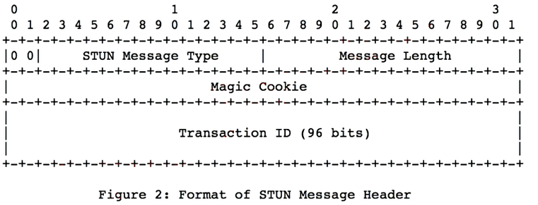

1. 前两位的 `00`，协议规定。用于区分复用同意端口时 STUN 协议，因为 STUN 协议有老协议（非00）和新协议（00）。
2. TYPE，使用 STUN 协议有很多消息类型。加上前边 `00` 一共 2 个字节（16 bit）。剩余 14 位中有有两位将 STUN 协议分成两种类型，即 C0 和 C1，12 位用于定义请求/指示。
    - C1C0：如下
      - 00：表示一个请求。
      - 01：表示一个指示。
      - 10：表示是请求成功的响应。
      - 11：表示是请求失败的响应。
    - 消息举例：
      - 0x0001：0x0 (c1)(c0) 1，即 C0C1 都是 0 表示请求，最后一位是 1，总的就是绑定消息。
      - 0x0101：C1C0 是 10，表示请求成功的响应，总的就是绑定响应。
      - 0x0111：C1C0 是 11，表示请求失败的响应，总的就是绑定错误。

    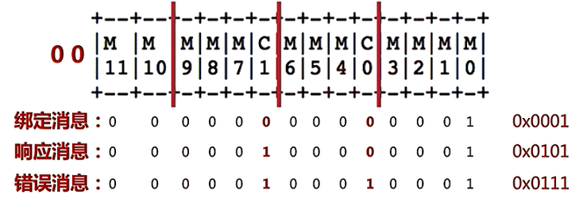

3. Length，Message 的长度。2 个字节的消息长度，不包括消息头。
4. Magic Cookie：魔法数，用于判断消息为 STUN 消息。4 字节，23 位，固定值位 0x2112A442，通过它可以判断客户端是否支持某些属性。
5. Transaction ID：发送与回复都是用同一个 ID 进行联系。12 字节，96 位。

## STUN Message Body

STUN 消息头后有 0 或多个属性，每个属性进行 TLV 编码：Type - Length - Value。先根据类型 Type，去除数据长度 Length 是多少，读取 Value 数据。

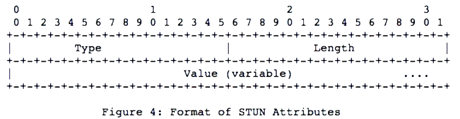

RFC3489 定义的属性：

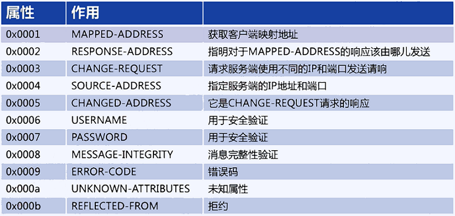

属性的使用，N/A 不必填写，M 必填，O 可选：

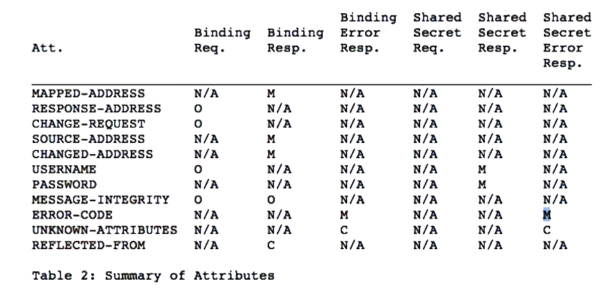

## ICE

ICE（interactive Connectivity Establishment），需要通讯的两端进行交互才能创建链接。建立过程如下图：

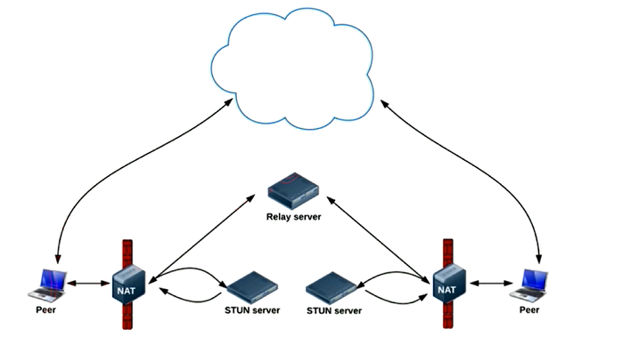

### ICE Candidate

可以进行链接的地址，每个 candidate 是一个地址，其包括：协议、IP、端口 和 类型。
> a=candidate:...UDP...192.169.1.2 1816  type:host

### Candidate 类型

1. 主机候选者。本机的地址信息。
2. 反射候选者。穿过 NAT 后被转换过的地址信息。
3. 中继候选者。当穿越 NAT 不成功后，需要服务器中转后的地址信息。

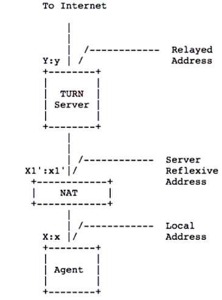

### 收集 Candidate

1. Host Candidate：本机所有 IP 和指定端口。
2. Reflexive Candidate：STUN/TURN 服务，得到反射 IP 端口信息。
3. Relay Candidate：向中继服务器发送 TURN 协议。（TURN 依赖 STUN 协议实现）

### ICE 具体功能

1. 收集 Candidate。
2. 对 Candidate Pair 排序。
   - 同意局域网，内网中：则使用本机 Candidate。
   - 不在同一网络中，P2P：使用 P2P 进行直连。
   - 最后选择中继模式。
3. 连通性检查：发送侦测包检查联通。

## DTLS 协议

DTLS 主要实现数据安全传输。

1. 非对称加密；
2. 数字签名；
3. 数字证书。

常见的加密算法：

|         |                                                                 |
| ------- | --------------------------------------------------------------- |
| MD5     | 使用的是哈希函数计算信息摘要                                    |
| SHA1    | 与 MD5 类似，但比 MD5 安全性更强                                |
| HMAC    | 以信息与 Key 为源，再通过 MD5/SHA1 输出摘要                     |
| RSA     | RSA 算法是目前最流行的非对称加密算法                            |
| ECC     | 也是一种非对称加密算法，它的安全性比 RSA 更高，不过性能要差一些 |
| AES/DES | 对称加密算法                                                    |

## OpenSSL

SSL 为安全套接字（Secure Sockets Layer）。OpenSSL 指开源的 SSL。SSL 3.0 之后标准化的 SSL 改名为 TLS（Transport Layer Security），因此 TLS 实际就是 SSL。

### TLS 协议

1. TLS 握手协议：交换证书、加密信息等信息交互。
2. TLS 记录协议：通过握手协议交换的加密信息，加密传输的数据。

### OpenSSL 原理

使用 OpenSSL 步骤：

1. SSL_CTX：SSL 上下文，包含版本、证书、密钥信息。
2. SSL：代表一个 SSL 链接，其与 Socket 进行对接。类似有记录协议负责数据加密解密。
3. SSL_Write/SSL_Read：读写数据。

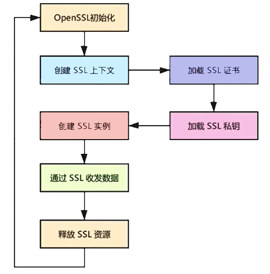

### DTLS

TLS 是基于 TCP 协议的。DTLS 就是基于 UDP 协议的。OpenSSL 这两个都支持。

DTLS 握手协议如下图：

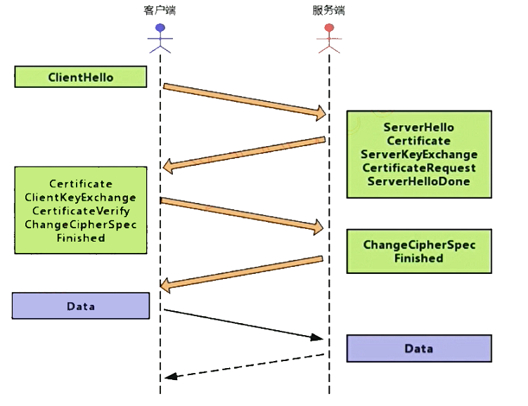

DTLS 时序图：

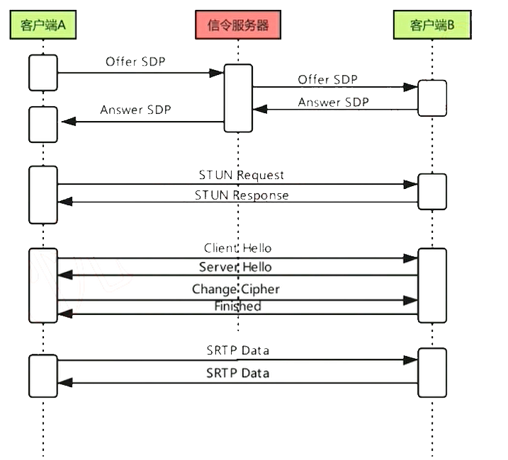

其中 SDP 包括密码信息用于验证客户端是有效的。

### DTLS-SRTP

DTLS 与 SRTP 协议的结合，使用 DTLS 握手交换证书、key，交换完成后将这些加密信息交给 SRTP 进行数据加密解密。跳过了 TLS 记录功能。
>SRTP（Secure Real-time Transport Protocol）是对RTP协议的扩展，旨在提供数据加密、消息认证、完整性保证和重放保护等。SRTP使用AES对RTP/RTCP数据包的载荷进行加密保护，使用HMAC-SHA1提供完整性保护和消息认证。

DTLS 主要解决的问题：

1. 交换密钥：真正进行加解密的是 SRTP 协议，SRTP 加解密使用的是对称加密算法，这样两边需要协商密钥，这就需要 DTLS 交换两边加密密钥。
2. 加密算法：握手时双方会提供支持的加密算法有哪些，选处同时支持优先级最高好的  WEBRTC 默认是 AES128。

SRTP 主要解决的问题：

1. 对数据加密，保证数据的安全性。
2. 保证数据的完整性。

SRTP 协议格式如下：

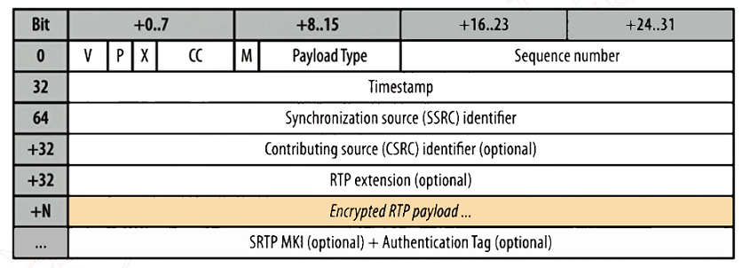

SRTP 协议头与 RTP 头是一样的，SRTP 对于 RTP 负载数据才进行加密。同时有一个扩展的字段，包含两个可选项 SRTP MKI （主 key 的标识）一般不用为 0，Auth Tag 是用于完整性校验，将 RTP 的头和它的加密数据进行哈希计算得出摘要附在加密数据后边也就是 Auth Tag 位置。这样接收端也就可以做一个同样的计算比对 Tag 判断数据完整性。

### libsrtp

通过 libsrtp 实现 SRTP 功能，使用步骤如下图：

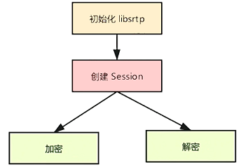

其中创建 Session 就是当 DTLS 握手完成后，拿到了 SSL 实例获取加密算法、密钥等信息设置进去创建 Session。一般有两个 Session 分别标识发出去的加密，和接受的解密。
