# WebRtc 协议

- [WebRtc 协议](#webrtc-协议)
  - [NAT 网络](#nat-网络)
    - [NAT 穿越原理](#nat-穿越原理)
    - [NAT 类型判断](#nat-类型判断)
  - [STUN 协议](#stun-协议)
    - [RFC STUN 规范](#rfc-stun-规范)
    - [STUN 协议规格](#stun-协议规格)
    - [STUN Message Body](#stun-message-body)
  - [TURN 协议](#turn-协议)
    - [TURN 例子](#turn-例子)
    - [TURN 使用的传输协议](#turn-使用的传输协议)
    - [TURN Client 请求](#turn-client-请求)
    - [TURN 发送机制](#turn-发送机制)
    - [TURN 的使用](#turn-的使用)
  - [ICE](#ice)
    - [ICE Candidate](#ice-candidate)
    - [Candidate 类型](#candidate-类型)
    - [收集 Candidate](#收集-candidate)
    - [ICE 具体功能](#ice-具体功能)
  - [DTLS 协议](#dtls-协议)
  - [OpenSSL](#openssl)
    - [TLS 协议](#tls-协议)
    - [OpenSSL 原理](#openssl-原理)
    - [DTLS](#dtls)
    - [DTLS-SRTP](#dtls-srtp)
    - [libsrtp](#libsrtp)
  - [抓取网络包分析](#抓取网络包分析)

WebRtc 传输需要依赖的网络知识包括：

- NAT（Network Address Translator）：将内网的 ip:port 映射成外网的 ip:port，这时再公网间通信的基础。
- STUN（Simple Traversal of UDP Through NAT）：作为中介用于穿越 NAT 交换通信两端在公网上的 ip:port。
- TURN（Traversal Using Relays around NAT）：STUN 穿越不成功的化就需要中继服务进行转发，这就是 TURN。
- ICE（interactive Connectivity Establishment）：将穿越 NAT 的方法集合起来进行最优选择。

## NAT 网络

NAT（Network Address Translator）将内网的 ip:port 映射成外网的 ip:port，这样再公网中才可以进行通信。

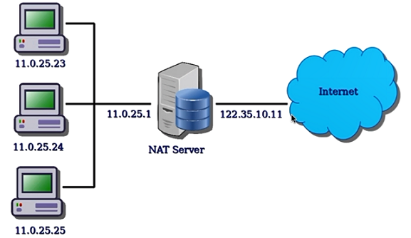

NAT 产生的原因：

- 由于 IPv4 的地址不够用。
- 处于网络安全的原因。

NAT 种类：

1. 完全锥形 NAT（Full Cone Nat）：当内网主机进行 Nat 映射后，外网所有主机都可以访问。
2. 地址限制锥形 NAT（Address Restricted Cone NAT）：当内网主机向外请求某个地址后，该地址才可以访问此内网主机。
3. 端口限制锥形 NAT（Port Restricted Cone NAT）：在 IP 地址的基础上，对端口也进行限制，也就是只有对方的某个应用才可以进行访问 NAT 映射的内网主机。
4. 对称型 NAT（Symmetric NAT）：内网主机经过 NAT 映射出的公网 IP:port 并不只一个，访问不同的主机由不同的 IP:port。

### NAT 穿越原理

- 完全锥形 NAT：内网主机向外网主机进行请求，通过 NAT 进行映射后在防火墙上打洞，外网的主机只要知道这个 NAT 映射后的 IP，即可访问内网主机。

    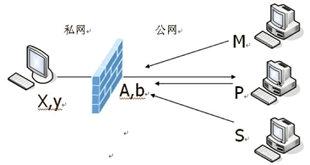

- 地址限制锥形 NAT：内网主机向外网主机进行请求，只有被请求的往往主机才可以向内网主机发送消息。

    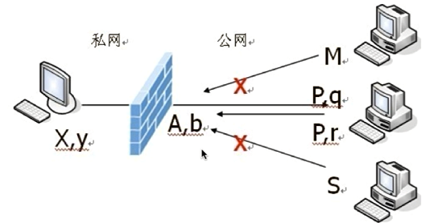

- 端口限制锥形 NAT：对端口进行限制。

    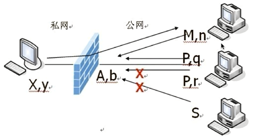

- 对称型 NAT：

    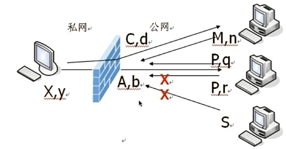

NAT 穿越原理，假设 C1 与 C2 通信，需要 C1、C2 互相知道对方地址：

- C1，C2 向 STUN 发送消息。
- 交换公网 IP 和端口。
- 如果是对称性，则需要 C1->C2，C2->C1，甚至是端口猜测。

NAT 穿越组合：

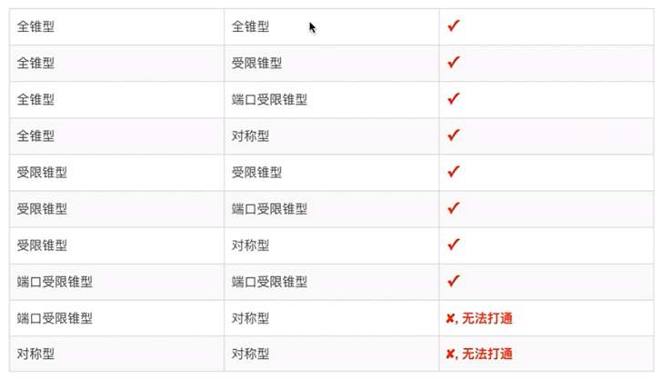

### NAT 类型判断

> [所谓探针技术，是通过在所有参与通信的实体上安装探测插件，以检测网络中是否存在 NAT 网关，并对不同 NAT 模型实施不同穿越方法的一种技术。STUN 服务器被部署在公网上，用于接收来自通信实体的探测请求，服务器会记录收到请求的报文地址和端口，并填写到回送的响应报文中。客户端根据接收到的响应消息中记录的地址和端口与本地选择的地址和端口进行比较，就能识别出是否存在 NAT 网关。如果存在 NAT 网关，客户端会使用之前的地址和端口向服务器的另外一个 IP 发起请求，重复前面的探测。然后再比较两次响应返回的结果判断出 NAT 工作的模式。由前述的一对多转换模型得知，除对称型 NAT 以外的模型，NAT 网关对内部主机地址端口的映射都是相对固定的，所以比较容易实现 NAT 穿越。而对称型 NAT 为每个连接提供一个映射，使得转换后的公网地址和端口对不可预测。此时 TURN 可以与 STUN 绑定提供穿越 NAT 的服务，即在公网服务器上提供一个“地址端口对”，所有此“地址端口对”接收到的数据会经由探测建立的连接转发到内网主机上。TURN 分配的这个映射“地址端口对”会通过 STUN 响应发给内部主机，后者将此信息放入建立连接·的信令中通知通信的对端。这种探针技术是一种通用方法，不用在 NAT 设备上为每种应用协议开发功能，相对于 ALG 方式有一定普遍性。但是 TURN 中继服务会成为通信瓶颈。而且在客户端中增加探针功能要求每个应用都要增加代码才能支持。](https://www.cnblogs.com/imstudy/p/5458133.html)

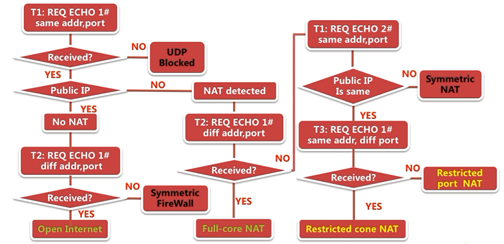

## STUN 协议

STUN 存在的目的，从客户端角度就是进行 NAT 穿越，客户端发送 STUN 消息到 STUN 服务，STUN 服务收到了后将发送消息这台主机的外网地址发回客户主机。查出自己位于哪种类型的 NAT 之后以及 NAT 为某一个本地端口所绑定的 Internet 端端口。当与另外一端通信时，通过交换 NAT 信息就可以建立通信链接了。

流媒体服务器也使用了 STUN，主要时为了客户端发起 STUN 请求时的用户名和密码。用于验证请求客户端是否合法。

STUN 时典型的客户端/服务器模式。客户端发送请求，服务端进行响应。

### RFC STUN 规范

RFC 有以下两种 STUN 协议规范，其区别在于 RFC5389 还可以使用 TCP 进行穿越，有一些 3489 的协议废除与新增。

1. RFC3489/STUN：Simple Traversal of UDP Through NAT。基础描述。使用 UDP 进行 NAT 穿越。
2. RFC5389/STUN：Session Traversal Utilities for Nat。增量修改。扩充了使用 TCP 进行 NAT 穿越。

### STUN 协议规格

STUN 协议由 20 个字节的 Stun header 组成和 Data 组成。在 Body 中可以由 0 个或多个 Attribute 属性。

1. 前两位的 `00`，协议规定。用于区分复用同意端口时 STUN 协议，因为 STUN 协议有老协议（非 00）和新协议（00）。
2. TYPE，使用 STUN 协议有很多消息类型。加上前边 `00` 一共 2 个字节（16 bit）。剩余 14 位中有有两位将 STUN 协议分成两种类型，即 C0 和 C1，12 位用于定义请求/指示。
    - C1C0：如下
      - 00：表示一个请求。
      - 01：表示一个指示。
      - 10：表示是请求成功的响应。
      - 11：表示是请求失败的响应。
    - 消息举例：
      - 0x0001：0x0 (c1)(c0) 1，即 C0C1 都是 0 表示请求，最后一位是 1，总的就是绑定消息。
      - 0x0101：C1C0 是 10，表示请求成功的响应，总的就是绑定响应。
      - 0x0111：C1C0 是 11，表示请求失败的响应，总的就是绑定错误。

    

3. Length，Message 的长度。2 个字节的消息长度，不包括消息头。
4. Magic Cookie：魔法数，用于判断消息为 STUN 消息。4 字节，32 位，固定值位 0x2112A442，通过它可以判断客户端是否支持某些属性。
5. Transaction ID：发送与回复都是用同一个 ID 进行联系。12 字节，96 位。

### STUN Message Body

STUN 消息头后有 0 或多个属性，每个属性进行 TLV 编码：Type - Length - Value。先根据类型 Type，去除数据长度 Length 是多少，读取 Value 数据。

RFC3489 定义的属性：

属性的使用，N/A 不必填写，M 必填，O 可选：

## TURN 协议

TURN 是为了解决对称 NAT 无法穿越的问题，客户端在发送数据时先传给 TURN 服务，通过 TURN 进行中转发个其他终端。

TURN 建立在 STUN 之上，消息格式使用 STUN 消息格式。TURN Client 要求服务器端分配一个公共 IP 和 PORT 用于接收或发送数据。

### TURN 例子

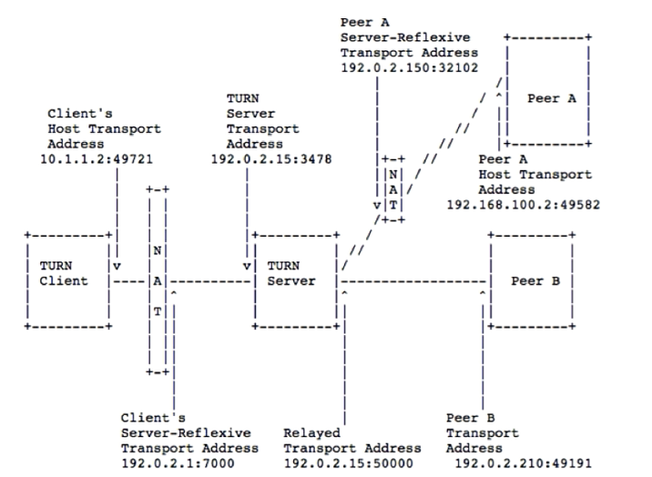

### TURN 使用的传输协议

| TURN client to TURN server | TURN server to peer |
| -------------------------- | ------------------- |
| UDP                        | UDP                 |
| TCP                        | UDP                 |
| TLS over TCP               | UDP                 |

### TURN Client 请求

前提，首先 客户端要先通过信令服务器获取到想要通信目标的公网 ip:port 信息。

1. 客户端发送 Allocate 请求。
2. 发送正确鉴权信息到 TURN 服务。
3. TURN 会返回一个服务端口。
4. 接下来 客户端向 TURN 发送数据，TURN 服务就会通过 192.0.2.15:50000 端口发送给目标的 peer A、B。
5. 反之 peer A、B 向 192.0.2.15:50000 TURN 服务发送数据也会转发给 客户端。
6. 客户端与 TURN 服务之间要定时发送 Refresh request 心跳。10 min。

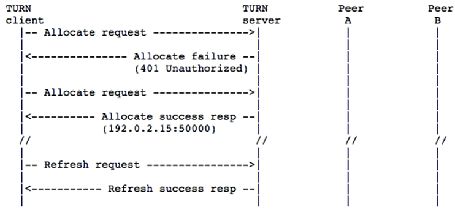

### TURN 发送机制

Send 和 Data：

1. 客户端先向服务端发送数据 Send ind (Peer A)，服务端接受到数据后需要将协议头去掉拿到原始数据，并将原始数据通过 50000 端口转给对端。
2. Peer A 想给客户端发数据，先通过 UPD 发送数据到 TURN 服务 50000 端口上，TURN 先加个头再转给客户端。
3. Send 和 Data 的缺点也就是每次发送时都要带个头信息。由于发送的流媒体数据数据量大，对带宽就有很大影响。

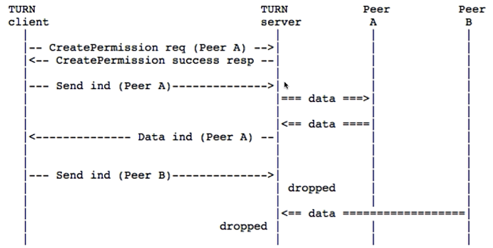

TURN Channel：先规定一个 Channel ID，想要通信的各方加入 Channel，数据传输便不用再加头了。

1. 客户端发起 ChannelBind 请求。绑定 Channel ID 就是 0x4001(随机产生)。
2. TURN 返回响应，建立 Channel。

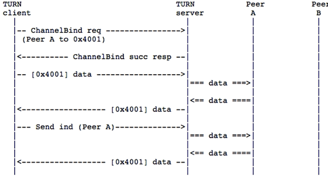

### TURN 的使用

1. STUN binding：客户端服务端打通。
2. Caller TURN allocation：请求 TURN server 服务。获取中继的 IP 地址和端口。
3. Caller sends offer：客户端通过信令 SDP 发起 offer 给被调用者， SDP 中包括媒体信息、中继 IP:Port 信息等等。
4. Callee TURN allocation：对方收到后也要给 TURN 服务发请求，用于数据交互。
5. Callee answers OK：回应客户端的 offer，发送 answers。至此数据交换完成。
6. Exchange candidate IP addresses：交换候选者，每一个 ip:port 信息都是一个候选者，可能发生数据交互信息。
7. ICE check for P2P connection：ICE 框架检查 P2P 是否成功。
8. If P2P unsuccessful，make relay connection：如果不成功需要中继服务。

## ICE

ICE（interactive Connectivity Establishment），需要通讯的两端进行交互才能创建链接。建立过程如下图：

### ICE Candidate

可以进行链接的地址，每个 candidate 是一个地址，其包括：协议、IP、端口 和 类型。通过 SDP 协议格式进行交换。
> a=candidate:...UDP...192.169.1.2 1816  type:host

### Candidate 类型

1. 主机候选者。本机的地址信息。
2. 反射候选者。穿过 NAT 后被转换过的地址信息。通过 STUN 获取到后，尝试 P2P 链接。
3. 中继候选者。当穿越 NAT 不成功后，需要服务器中转后的地址信息。

### 收集 Candidate

1. Host Candidate：本机所有 IP 和指定端口。
2. Reflexive Candidate：STUN/TURN 服务，得到反射 IP 端口信息。
3. Relay Candidate：向中继服务器发送 TURN 协议。（TURN 依赖 STUN 协议实现）

### ICE 具体功能

1. 收集 Candidate。
2. 对 Candidate Pair 排序。
   - 同意局域网，内网中：则使用本机 Candidate。
   - 不在同一网络中，P2P：使用 P2P 进行直连。
   - 最后选择中继模式。
3. 连通性检查：发送侦测包检查联通。

## DTLS 协议

DTLS 主要实现数据安全传输。

1. 非对称加密；
2. 数字签名；
3. 数字证书。

常见的加密算法：

|         |                                                                 |
| ------- | --------------------------------------------------------------- |
| MD5     | 使用的是哈希函数计算信息摘要                                    |
| SHA1    | 与 MD5 类似，但比 MD5 安全性更强                                |
| HMAC    | 以信息与 Key 为源，再通过 MD5/SHA1 输出摘要                     |
| RSA     | RSA 算法是目前最流行的非对称加密算法                            |
| ECC     | 也是一种非对称加密算法，它的安全性比 RSA 更高，不过性能要差一些 |
| AES/DES | 对称加密算法                                                    |

## OpenSSL

SSL 为安全套接字（Secure Sockets Layer）。OpenSSL 指开源的 SSL。SSL 3.0 之后标准化的 SSL 改名为 TLS（Transport Layer Security），因此 TLS 实际就是 SSL。

### TLS 协议

1. TLS 握手协议：交换证书、加密信息等信息交互。
2. TLS 记录协议：通过握手协议交换的加密信息，加密传输的数据。

### OpenSSL 原理

使用 OpenSSL 步骤：

1. SSL_CTX：SSL 上下文，包含版本、证书、密钥信息。
2. SSL：代表一个 SSL 链接，其与 Socket 进行对接。类似有记录协议负责数据加密解密。
3. SSL_Write/SSL_Read：读写数据。

### DTLS

TLS 是基于 TCP 协议的。DTLS 就是基于 UDP 协议的。OpenSSL 这两个都支持。

DTLS 握手协议如下图：

DTLS 时序图：

其中 SDP 包括密码信息用于验证客户端是有效的。

### DTLS-SRTP

DTLS 与 SRTP 协议的结合，使用 DTLS 握手交换证书、key，交换完成后将这些加密信息交给 SRTP 进行数据加密解密。跳过了 TLS 记录功能。
>SRTP（Secure Real-time Transport Protocol）是对 RTP 协议的扩展，旨在提供数据加密、消息认证、完整性保证和重放保护等。SRTP 使用 AES 对 RTP/RTCP 数据包的载荷进行加密保护，使用 HMAC-SHA1 提供完整性保护和消息认证。

DTLS 主要解决的问题：

1. 交换密钥：真正进行加解密的是 SRTP 协议，SRTP 加解密使用的是对称加密算法，这样两边需要协商密钥，这就需要 DTLS 交换两边加密密钥。
2. 加密算法：握手时双方会提供支持的加密算法有哪些，选处同时支持优先级最高好的  WEBRTC 默认是 AES128。

SRTP 主要解决的问题：

1. 对数据加密，保证数据的安全性。
2. 保证数据的完整性。

SRTP 协议格式如下：

SRTP 协议头与 RTP 头是一样的，SRTP 对于 RTP 负载数据才进行加密。同时有一个扩展的字段，包含两个可选项 SRTP MKI （主 key 的标识）一般不用为 0，Auth Tag 是用于完整性校验，将 RTP 的头和它的加密数据进行哈希计算得出摘要附在加密数据后边也就是 Auth Tag 位置。这样接收端也就可以做一个同样的计算比对 Tag 判断数据完整性。

### libsrtp

通过 libsrtp 实现 SRTP 功能，使用步骤如下图：

其中创建 Session 就是当 DTLS 握手完成后，拿到了 SSL 实例获取加密算法、密钥等信息设置进去创建 Session。一般有两个 Session 分别标识发出去的加密，和接受的解密。

## 抓取网络包分析

1. tcpdump：
   - tcpdump -i eth0 src port 80 -xx -Xs 0 -w test.cap
   - -i：指定网卡。
   - src：指明包的来源。
   - port：指明端口号。
   - -xx：指抓到的包以 16 进制显示。
   - -X：指以 ASCII 码显示。
   - -s 0：指明抓整个包。
   - -w：写到指定文件。

2. wireshark：
   - 逻辑语句：
     - 与：and 或 &&。
     - 或：or 或 ||。
     - 非：not 或 !。
     - 等于：eq 或 ==。
     - 小于：lt 或 <。
     - 大于：gt 或 >。
     - 小于等于：le 或 <=。
     - 大于等于：ge 或 >=。
     - 不等于：ne 或 !=。
   - 按协议过滤：
     - stun：过滤搜索 stun。turn 服务是基于 stun，因此可以看到 stun 协议进行 allocate Request UDP 请求。
     - tcp。
     - udp。
   - 按 IP 过滤：
     - ip.dst == xxx.xxx.xxx.xxx：指定目的 ip 地址。
     - ip.src == xxx.xxx.xxx.xxx：指定发送端源地址 ip。
     - ip.addr == xxx.xxx.xxx.xxx：指定 ip。
   - 按 Port 过滤：
     - tcp.port == 8080。
     - udp.port == 3478。
     - udp.dstport == 3478。
     - udp.srcport == 3478。
   - 长度过滤：
     - udp.length < 30。
     - tcp.length < 30。
     - http.content_length < 30。
