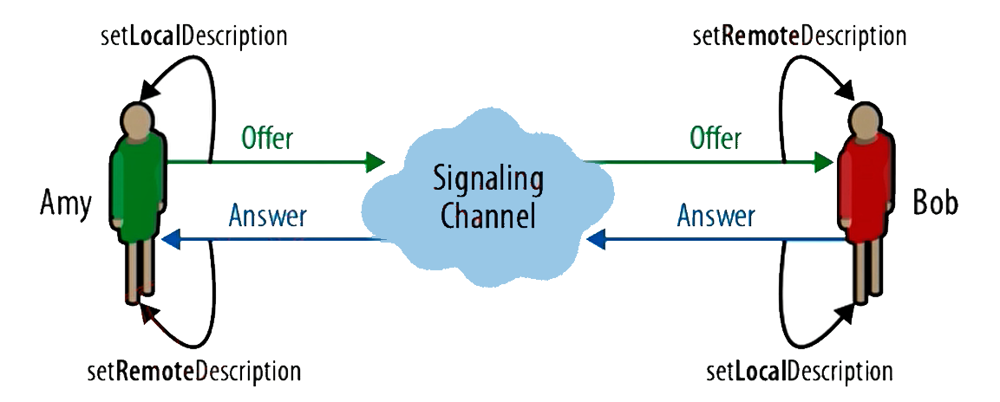

# WebRtc 媒体协商

- [WebRtc 媒体协商](#webrtc-媒体协商)
  - [媒体协商](#媒体协商)
    - [媒体协商的方法](#媒体协商的方法)
  - [SDP 协议](#sdp-协议)
    - [SDP 规范](#sdp-规范)
    - [会话层](#会话层)
    - [媒体层](#媒体层)
    - [SDP 描述信息](#sdp-描述信息)

## 媒体协商

A 与 B 之间在媒体通信之前需要进行通信让彼此知道对方的媒体相关信息，例如知道对方编解码能力、是否有音频、音视频格式等等，了解是否能解码对方的音视频数据，交换信息的过程就是媒体协商。

- 媒体协商链接创建流程：
  1. A 发起者通过 peerconnection 发起 offer 请求。
  2. A 通过 setLocalDescription 将请求缓存。
  3. A 通过信令将 offer 发送对端。
  4. B 接收端通过 setRemoteDescription 将收到的 offer 缓存。
  5. B 同样通过 peerconnection 生成一个 Answer。
  6. B 调用 setLocalDescription 将请求回复的 Answer 缓存。
  7. B 通过信令将 Answer 发送对端。
  8. A 收到 Answer 后调用 setRemoteDescription 将收到的 offer 缓存。

收到的 offer 和 answer 就是标识着对方的媒体流是什么，支持哪些编解码，SSRC、ICE、DTLS信息等。对于流媒体服务器来说，当接受这些信息需要去底层加载相应的编解码器，用来解码对端的信息；同时还可以根据对端编码能力信息，选择一个最优的编码器来编码数据。

同时其中的 offer 与 answer 可以不采用 SDP 协议格式，传递自定义的格式信息到标准终端时需要进行转换。

### 媒体协商的方法

1. createOffer
2. createAnswer
3. setLocalDescription
4. setRemoteDescription

## SDP 协议

SDP（Session Description Protocol）它只是一种信息格式的描述标准，本身不属于传输协议，但是可以被其他传输协议用来交换必要的信息。

### SDP 规范

1. `多个`媒体级描述：对于一个终端来说有几路视频几路音频、对于每一路音视频可以使用哪些编解码器、对于各个编解码器参数的定义都是在 SDP 中`媒体级描述参数`中描述。
2. `一个`会话级描述：对于 SDP 协议的版本、使用 SDP 的网络类型信息。
3. 由多个 `<type> = <value>` 组成。

### 会话层

1. 会话的名称与目的。
2. 会话的存活时间。
3. 会话中包括多个媒体信息。

### 媒体层

1. 媒体格式。
2. 传输协议：TCP/UDP。
3. 传输 IP 和端口。
4. 媒体的负载类型：AAC、OPUS、H264等等。

### SDP 描述信息

1. Session Description：
   - `v=(protocol version)`：版本信息，各段之间信息传输版本要一致。
   - `o=(owner/create and session identifier)`：SDP Session 由谁创建的。
   - `s=(session name)`：session 的名字。
   - `c=*(conn info - optional if included at session-level`：可选，每个媒体层都会进行 connection 描述，如果媒体层没有进行 conn 描述则使用会话层。
   - `t=(time the session is active`：session 存活时间，设置为 0 标识一直存活。
   - `a=*(zero or more session attribute lines)`：属性，可以由 0 个或者多个，每个属性的含义对于不同的应用场景是不同的。媒体曾同样也有自己的 attribute 描述，媒体曾描述的是媒体相关属性。

2. Media Description：
   - `m=(media name and transport address)`：描述媒体的名字以及传输的地址，例如标识音频还是视频、使用的视频格式、音频格式等等信息。
   - `c=*(conn info - optional if included at session-level`：媒体层定义了就是用媒体曾的，否则就使用会话层。
   - `b=*(bandwidth information)`：带宽控制。
   - `a=*(zero or more session attribute lines)`：属性。
