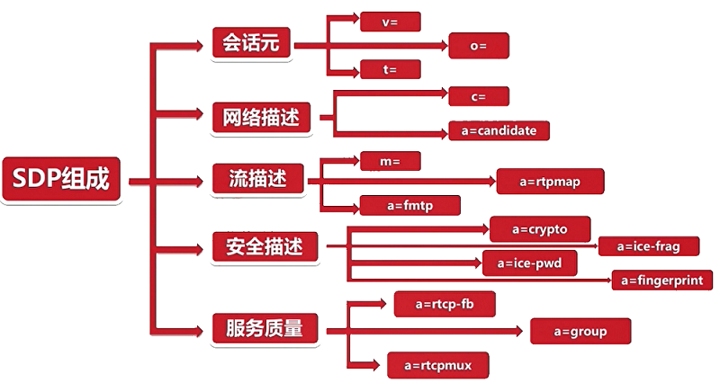
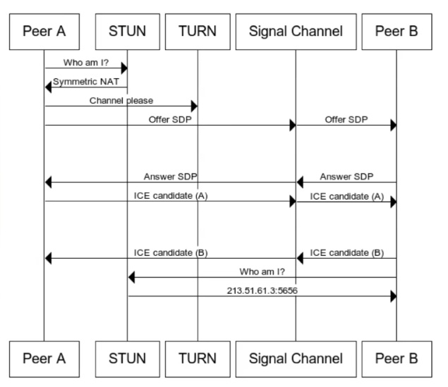

# WebRtc 媒体协商

- [WebRtc 媒体协商](#webrtc-媒体协商)
  - [媒体协商](#媒体协商)
    - [媒体协商的方法](#媒体协商的方法)
  - [SDP 协议](#sdp-协议)
    - [SDP 规范](#sdp-规范)
    - [会话层](#会话层)
    - [媒体层](#媒体层)
    - [SDP 描述信息](#sdp-描述信息)
    - [SDP 字段含义](#sdp-字段含义)
  - [WebRtc 中的 SDP](#webrtc-中的-sdp)
    - [简单示例](#简单示例)
  - [总结](#总结)

## 媒体协商

A 与 B 之间在媒体通信之前需要进行通信让彼此知道对方的媒体相关信息，例如知道对方编解码能力、是否有音频、音视频格式等等，了解是否能解码对方的音视频数据，交换信息的过程就是媒体协商。

- 媒体协商链接创建流程：
  1. A 发起者通过 peerconnection 发起 offer 请求。
  2. A 通过 setLocalDescription 将请求缓存。
  3. A 通过信令将 offer 发送对端。
  4. B 接收端通过 setRemoteDescription 将收到的 offer 缓存。
  5. B 同样通过 peerconnection 生成一个 Answer。
  6. B 调用 setLocalDescription 将请求回复的 Answer 缓存。
  7. B 通过信令将 Answer 发送对端。
  8. A 收到 Answer 后调用 setRemoteDescription 将收到的 offer 缓存。


收到的 offer 和 answer 就是标识着对方的媒体流是什么，支持哪些编解码，SSRC、ICE、DTLS信息等。对于流媒体服务器来说，当接受这些信息需要去底层加载相应的编解码器，用来解码对端的信息；同时还可以根据对端编码能力信息，选择一个最优的编码器来编码数据。

同时其中的 offer 与 answer 可以不采用 SDP 协议格式，传递自定义的格式信息到标准终端时需要进行转换。

### 媒体协商的方法

1. createOffer
2. createAnswer
3. setLocalDescription
4. setRemoteDescription

## SDP 协议

SDP（Session Description Protocol）它只是一种信息格式的描述标准，本身不属于传输协议，但是可以被其他传输协议用来交换必要的信息。

### SDP 规范

1. `多个`媒体级描述：对于一个终端来说有几路视频几路音频、对于每一路音视频可以使用哪些编解码器、对于各个编解码器参数的定义都是在 SDP 中`媒体级描述参数`中描述。
2. `一个`会话级描述：对于 SDP 协议的版本、使用 SDP 的网络类型信息。
3. 由多个 `<type> = <value>` 组成。

### 会话层

1. 会话的名称与目的。
2. 会话的存活时间。
3. 会话中包括多个媒体信息。

### 媒体层

1. 媒体格式。
2. 传输协议：TCP/UDP。
3. 传输 IP 和端口。
4. 媒体的负载类型：AAC、OPUS、H264等等。

### SDP 描述信息

1. Session Description：
   - `v=(protocol version)`：版本信息，各段之间信息传输版本要一致。
   - `o=(owner/create and session identifier)`：SDP Session 由谁创建的。
   - `s=(session name)`：session 的名字。
   - `c=*(conn info - optional if included at session-level`：可选，每个媒体层都会进行 connection 描述，如果媒体层没有进行 conn 描述则使用会话层。
   - `t=(time the session is active`：session 存活时间，设置为 0 标识一直存活。
   - `a=*(zero or more session attribute lines)`：属性，可以由 0 个或者多个，每个属性的含义对于不同的应用场景是不同的。媒体曾同样也有自己的 attribute 描述，媒体曾描述的是媒体相关属性。

2. Media Description：
   - `m=(media name and transport address)`：描述媒体的名字以及传输的地址，例如标识音频还是视频、使用的视频格式、音频格式等等信息。
   - `c=*(conn info - optional if included at session-level`：媒体层定义了就是用媒体曾的，否则就使用会话层。
   - `b=*(bandwidth information)`：带宽控制。
   - `a=*(zero or more session attribute lines)`：属性。

### SDP 字段含义

1. Version 必选。
   - `v=0`：SDP 的版本号，不包括次版本号。
2. Session Name 必选.
   - `s=<session name>`：会话名，`s=-` 表示忽略会话名。
3. Origin/Owner 必选。
   - `o=<username><session id><version><network type><address type><address>`：Session 所属信息。具体格式如下例。
   - `o=- 2387345594375924353 2 IN IP4 127.0.0.1`。
4. Connection 可选。
   - `c=<network type><address type><connection address>`：链接类型。
   - `c=IN IP4 0.0.0.0`。
5. Media 必选。
   - `m=<media><port><transport><fmt/payload type list>`：重要字段，描述了音视频基本信息。
   - `m=audio 1024 UDP/TLS/RTP/SAVPF 111 103 104 9 0 8 106 105 13 126`：UDP/TLS/RTP/SAVPF 传输时底层使用 UDP，基于 UDP 使用 DTLS，在基于 DTLS 使用 SRTP，SRTP 总的内容就是 SAVPF，S 表示安全，A 表示 audio，V 表示 video，P 表示 profile 可配置，F 表示 FeedBack 就是 RTCP。在接下来就是 fmt/payload type list 很明显时 type list，这些数字具体含义需要上下文解析。
6. Attributes 可选。
   - `a=<TYPE>` 或 `a=<TYPE>:<VALUES>`。
   - `a=framerate:<帧速率>`：设置一个帧率。
7. rtpmap 可选。
   - `a=rtpmap:<fmt/payload type><encoding name>/<clock rate>[/<encodingparameters>]`：对 rtp 进行配置所形成的配置表，其属于 attributes 的一种所以 `a=`。
   - `a=rtpmap:103 ISAC/16000`：描述 103 表示编码器为 ISAC 时钟频率为 16000，就是上边 Media 例子中 Payload type list 中的 103 所表示。
8. fmtp 可选。
   - `a=fmtp:<format/payload type>`：format parameters。和上边 rtpmap 类似。
   - `a=fmtp:103 apt=106`：描述 103 与 106 进行关连。

## WebRtc 中的 SDP

WebRtc 所使用的 SDP 协议与标准的还是存在些区别，它分为五个层面：

1. 会话元：与前边介绍的会话层一样。
   - `v=`、`o=`、`t=`。
2. 网络描述：将 Media 网络描述与会话网络描述，单独抽出一层 SDP 网络描述。
   - `c=`、`a=candidate`：标准 SDP 中是没有候选者属性的。标准的 `c=` 再 WebRtc 中没有实际使用。
3. 流描述：Media 描述。
   - `m=`、`a=rtpmap`、`a=fmtp`：m 与标准一致，还可以使用 rtpmap、fmtp 属性进行设置。
4. 安全描述：一般 WebRtc 需要与浏览器进行对接，需要很安全的保护。
   - `a=crypto`：crypto 保证媒体各个端之间数据安全性，一般传输协议加密 DTL+SRTP，其中数据加密使用什么算法使用此属性定义。
   - `a=ice-frag/ice-passwd`：双方通信前首先进行媒体协商，这时双方设置好 ice-frag 和 ice-passwd，用户在进行 DTLS 连接之前需要进行身份认证，其协议通过 STUN 发送出去，带着 ice-frag 和 ice-passwd 到流媒体服务器端进行验证，这两个值就是通过这里设置的。
   - `a=fingerprint`：证书指纹。DTLS 握手会交换证书，通过 fingerprint 保证证书未被篡改。
5. 服务质量：对于流媒体的服务质量有单独描述。
   - `a=rtcp-feedback`：反馈信息。带宽大小、网络阻塞等等。
   - `a=group`：传输时音频流与视频流是共用同一个通道还是分通道进行的。
   - `a=rtcpmux`：使用 rtp 传数据用一个端口，默认 rtcp 是 rtp->port +1。如果设置此属性，将 rtp 与 rtcp 端口复用。



### 简单示例

```shell
                      【Session Metadata部分】
v=0
//sdp版本号，一直为0,rfc4566规定

o=- 7017624586836067756 2 IN IP4 127.0.0.1
//origion/owner  o=<username> <session id> <version> <network type> <address type> <unicast-address>
//username如何没有使用-代替，7017624586836067756是整个会话的编号，2代表会话版本，如果在会话
//过程中有改变编码之类的操作，重新生成sdp时,sess-id不变，sess-version加1

s=-
//会话名,必选，没有的话使用-代替

t=0 0
//两个值分别是会话的起始时间和结束时间，这里都是0代表没有限制

a=group:BUNDLE audio video data
//需要共用一个传输通道传输的媒体，如果没有这一行，音视频，数据就会分别单独用一个udp端口来发送

a=msid-semantic: WMS h1aZ20mbQB0GSsq0YxLfJmiYWE9CBfGch97C
//WMS是WebRTC Media Stream简称，这一行定义了本客户端支持同时传输多个流，一个流可以包括多个track,
//一般定义了这个，后面a=ssrc这一行就会有msid,mslabel等属性

                          【Stream Description部分】
                          
        【audio部分】
        
m=audio 9 UDP/TLS/RTP/SAVPF 111 103 104 9 0 8 106 105 13 126
//m = <media><port><transport><fmt/payload type list>
//m=audio说明本会话包含音频，9代表音频使用端口9来传输，但是在webrtc中一现在一般不使用，如果设置为0，代表不
//传输音频,UDP/TLS/RTP/SAVPF是表示用户来传输音频支持的协议，udp，tls,rtp代表使用udp来传输rtp包，并使用tls加密
//SAVPF代表使用srtcp的反馈机制来控制通信过程,后台111 103 104 9 0 8 106 105 13 126表示本会话音频支持的编码，后台几行会有详细补充说明

c=IN IP4 0.0.0.0
//这一行表示你要用来接收或者发送音频使用的IP地址，webrtc使用ice传输，不使用这个地址

a=rtcp:9 IN IP4 0.0.0.0
//用来传输rtcp地地址和端口，webrtc中不使用

a=ice-ufrag:khLS
a=ice-pwd:cxLzteJaJBou3DspNaPsJhlQ
//以上两行是ice协商过程中的安全验证信息

a=fingerprint:sha-256 FA:14:42:3B:C7:97:1B:E8:AE:0C2:71:03:05:05:16:8F:B9:C7:98:E9:60:43:4B:5B:2C:28:EE:5C:8F3:17
//以上这行是dtls协商过程中需要的认证信息

a=setup:actpass
//以上这行代表本客户端在dtls协商过程中，可以做客户端也可以做服务端，参考rfc4145 rfc4572

a=mid:audio
//在前面BUNDLE这一行中用到的媒体标识

a=extmap:1 urn:ietf:params:rtp-hdrext:ssrc-audio-level
//上一行指出我要在rtp头部中加入音量信息，参考 rfc6464

a=sendrecv
//上一行指出我是双向通信，另外几种类型是recvonly,sendonly,inactive

a=rtcp-mux
//上一行指出rtp,rtcp包使用同一个端口来传输

//下面几行都是对m=audio这一行的媒体编码补充说明，指出了编码采用的编号，采样率，声道等
a=rtpmap:111 opus/48000/2
//可选 a=rtpmap:<fmt/payload type><encoding name>/<clock rate>[/<encodingparameters>]

a=rtcp-fb:111 transport-cc
//以上这行说明opus编码支持使用rtcp来控制拥塞，参考https://tools.ietf.org/html/draft-holmer-rmcat-transport-wide-cc-extensions-01

a=fmtp:111 minptime=10;useinbandfec=1
//可选 a=fmtp:<fmt/payload type> parameters  对rtpmap进一步说明
//对opus编码可选的补充说明,minptime代表最小打包时长是10ms，useinbandfec=1代表使用opus编码内置fec特性

a=rtpmap:103 ISAC/16000
a=rtpmap:104 ISAC/32000
a=rtpmap:9 G722/8000
a=rtpmap:0 PCMU/8000
a=rtpmap:8 PCMA/8000
a=rtpmap:106 CN/32000
a=rtpmap:105 CN/16000
a=rtpmap:13 CN/8000
a=rtpmap:126 telephone-event/8000
a=ssrc:18509423 cname:sTjtznXLCNH7nbRw
//cname用来标识一个数据源，ssrc当发生冲突时可能会发生变化，但是cname不会发生变化，也会出现在rtcp包中SDEC中，
//用于音视频同步

a=ssrc:18509423 msid:h1aZ20mbQB0GSsq0YxLfJmiYWE9CBfGch97C 15598a91-caf9-4fff-a28f-3082310b2b7a
//以上这一行定义了ssrc和WebRTC中的MediaStream,AudioTrack之间的关系，msid后面第一个属性是stream-d,第二个是track-id

a=ssrc:18509423 mslabel:h1aZ20mbQB0GSsq0YxLfJmiYWE9CBfGch97C
a=ssrc:18509423 label:15598a91-caf9-4fff-a28f-3082310b2b7a

       【video部分】
       
m=video 9 UDP/TLS/RTP/SAVPF 100 101 107 116 117 96 97 99 98
//参考上面m=audio,含义类似

c=IN IP4 0.0.0.0
a=rtcp:9 IN IP4 0.0.0.0
a=ice-ufrag:khLS
a=ice-pwd:cxLzteJaJBou3DspNaPsJhlQ
a=fingerprint:sha-256 FA:14:42:3B:C7:97:1B:E8:AE:0C2:71:03:05:05:16:8F:B9:C7:98:E9:60:43:4B:5B:2C:28:EE:5C:8F3:17
a=setup:actpass
a=mid:video
a=extmap:2 urn:ietf:params:rtp-hdrext:toffset
a=extmap:3 http://www.webrtc.org/experiments/rtp-hdrext/abs-send-time
a=extmap:4 urn:3gpp:video-orientation
a=extmap:5 http://www.ietf.org/id/draft-hol ... de-cc-extensions-01
a=extmap:6 http://www.webrtc.org/experiments/rtp-hdrext/playout-delay
a=sendrecv
a=rtcp-mux
a=rtcp-rsize
a=rtpmap:100 VP8/90000
a=rtcp-fb:100 ccm fir
//ccm是codec control using RTCP feedback message简称，意思是支持使用rtcp反馈机制来实现编码控制，fir是Full Intra Request
//简称，意思是接收方通知发送方发送幅完全帧过来
a=rtcp-fb:100 nack
//支持丢包重传，参考rfc4585

a=rtcp-fb:100 nack pli
//支持关键帧丢包重传,参考rfc4585

a=rtcp-fb:100 goog-remb
//支持使用rtcp包来控制发送方的码流

a=rtcp-fb:100 transport-cc
//参考上面opus
a=rtpmap:101 VP9/90000
a=rtcp-fb:101 ccm fir
a=rtcp-fb:101 nack
a=rtcp-fb:101 nack pli
a=rtcp-fb:101 goog-remb
a=rtcp-fb:101 transport-cc
a=rtpmap:107 H264/90000
a=rtcp-fb:107 ccm fir
a=rtcp-fb:107 nack
a=rtcp-fb:107 nack pli
a=rtcp-fb:107 goog-remb
a=rtcp-fb:107 transport-cc
a=fmtp:107 level-asymmetry-allowed=1;packetization-mode=1;profile-level-id=42e01f

//h264编码可选的附加说明
a=rtpmap:116 red/90000
//fec冗余编码，一般如果sdp中有这一行的话，rtp头部负载类型就是116，否则就是各编码原生负责类型

a=rtpmap:117 ulpfec/90000
//支持ULP FEC，参考rfc5109

a=rtpmap:96 rtx/90000
a=fmtp:96 apt=100
//以上两行是VP8编码的重传包rtp类型

a=rtpmap:97 rtx/90000
a=fmtp:97 apt=101
a=rtpmap:99 rtx/90000
a=fmtp:99 apt=107
a=rtpmap:98 rtx/90000
a=fmtp:98 apt=116
a=ssrc-group:FID 3463951252 1461041037
//在webrtc中，重传包和正常包ssrc是不同的，上一行中前一个是正常rtp包的ssrc,后一个是重传包的ssrc

a=ssrc:3463951252 cname:sTjtznXLCNH7nbRw
a=ssrc:3463951252 msid:h1aZ20mbQB0GSsq0YxLfJmiYWE9CBfGch97C ead4b4e9-b650-4ed5-86f8-6f5f5806346d
a=ssrc:3463951252 mslabel:h1aZ20mbQB0GSsq0YxLfJmiYWE9CBfGch97C
a=ssrc:3463951252 label:ead4b4e9-b650-4ed5-86f8-6f5f5806346d
a=ssrc:1461041037 cname:sTjtznXLCNH7nbRw
a=ssrc:1461041037 msid:h1aZ20mbQB0GSsq0YxLfJmiYWE9CBfGch97C ead4b4e9-b650-4ed5-86f8-6f5f5806346d
a=ssrc:1461041037 mslabel:h1aZ20mbQB0GSsq0YxLfJmiYWE9CBfGch97C
a=ssrc:1461041037 label:ead4b4e9-b650-4ed5-86f8-6f5f5806346d
m=application 9 DTLS/SCTP 5000
c=IN IP4 0.0.0.0
a=ice-ufrag:khLS
a=ice-pwd:cxLzteJaJBou3DspNaPsJhlQ
a=fingerprint:sha-256 FA:14:42:3B:C7:97:1B:E8:AE:0C2:71:03:05:05:16:8F:B9:C7:98:E9:60:43:4B:5B:2C:28:EE:5C:8F3:17
a=setup:actpass
a=mid:data
a=sctpmap:5000 webrtc-datachannel 1024
```

## 总结

提上整体的 WebRtc 协议流程如下：


