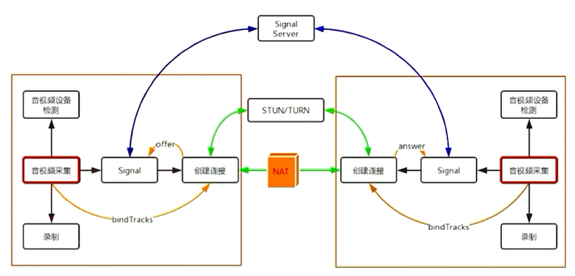
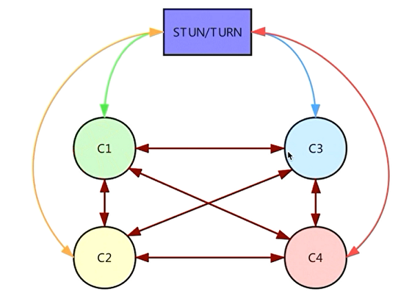
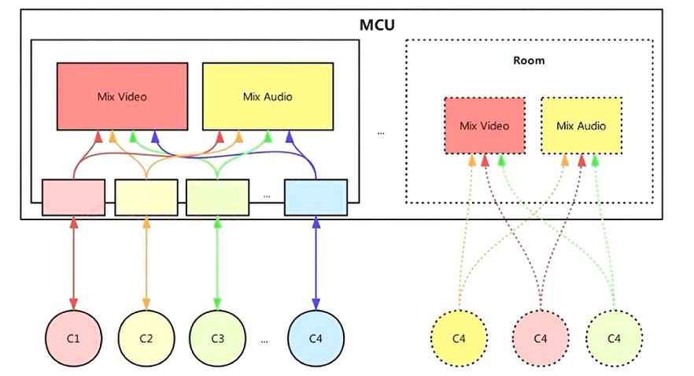
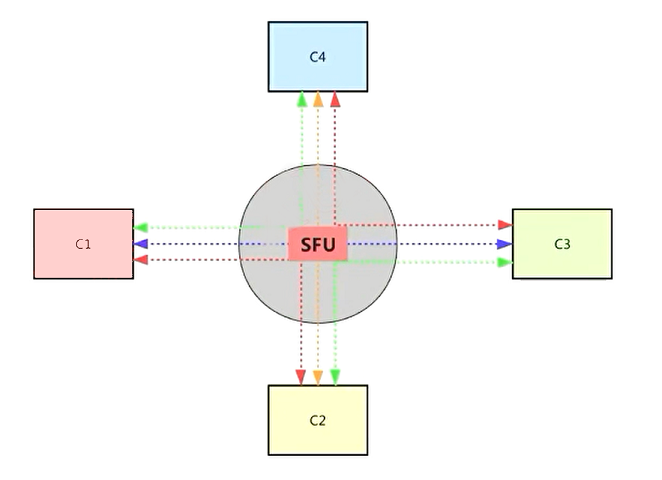
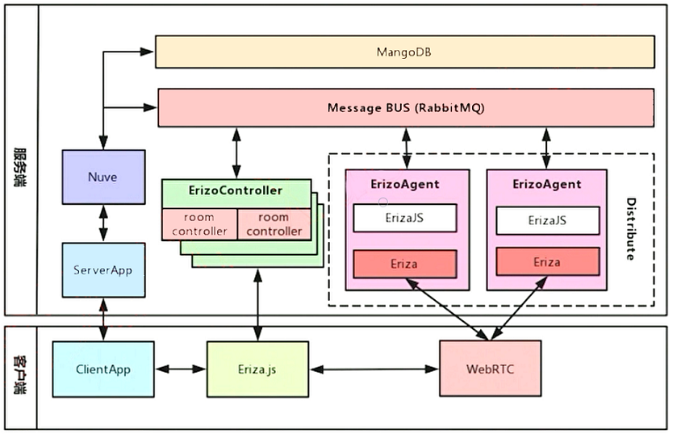
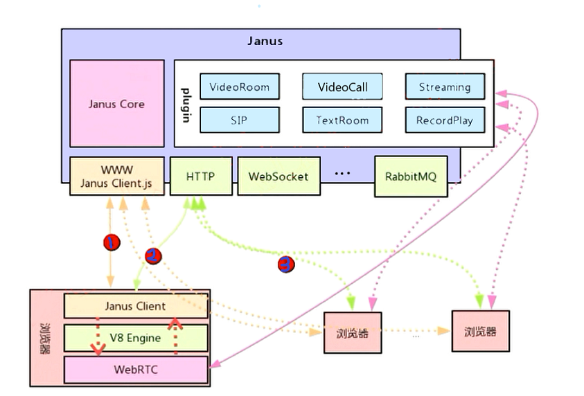
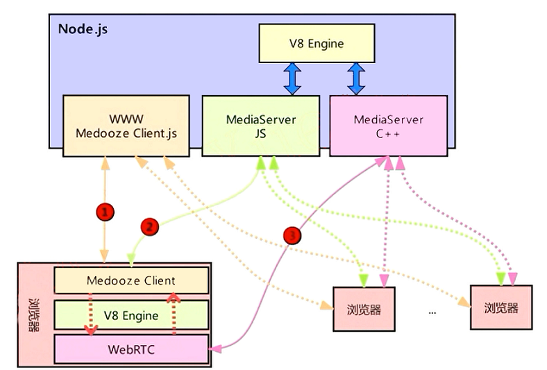
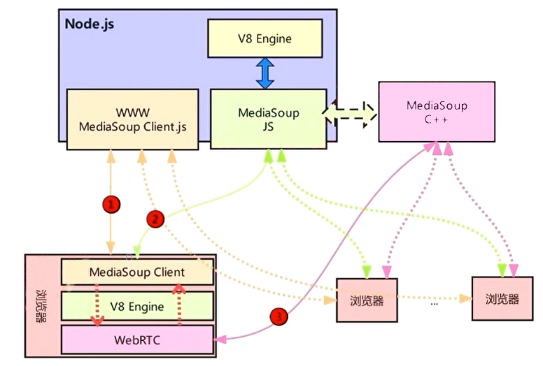

# 流媒体服务器

- [流媒体服务器](#流媒体服务器)
  - [多人音视频架构](#多人音视频架构)
    - [1 对 1 的通信模型](#1-对-1-的通信模型)
    - [Mesh 通信模型](#mesh-通信模型)
    - [MCU 通信模型](#mcu-通信模型)
    - [SFU 通信模型](#sfu-通信模型)
  - [市面上主流的音视频流媒体框架](#市面上主流的音视频流媒体框架)
    - [Licode 架构](#licode-架构)
    - [Janus SFU 架构](#janus-sfu-架构)
    - [Medooze 架构](#medooze-架构)
    - [MediaSoup 整体架构](#mediasoup-整体架构)
  - [总结](#总结)

WebRtc 有两层的含义：

1. 代之 Google 开源的客户端，应用于浏览器之间的流媒体实时通讯。
2. 规范的角度，WebRtc 规范了客户端行为，如 进行媒体协商的方法，协议的内容等等。

对于服务端，包括信令服务端、中继服务端这些在 WebRtc 中并没有规范，这是由使用 WebRtc 的厂商自己实现的。

## 多人音视频架构

常见架构分析可以复习下[之前的章节](./00_网络音视频交互架构.md)。

SFU 架构是目前比较流行的。

### 1 对 1 的通信模型

1 对 1 的通信模型建立是经典的 WebRtc 使用场景。

1. 首先进行本地音视频设备的检查，并进行音视频数据采集，采集的视频数据通常格式为 yuv420。然后将其编码为 H264/H265/VP8/VP9 等，准备传输。
2. 初始化 Signal 信令模块，用于媒体协商、创建链接。
3. 进行 P2P Nat 穿越。如果不能直接链接，就需要通过 STUN/TURN 服务进行中转。

### Mesh 通信模型

Mesh 的方案不能进行 TURN 服务器数据中转的，需要各个端进行链接。

### MCU 通信模型

MCU 与各个终端相连接，并将接受到的各个终端数据送到对应的模块中处理，如视频数据，先对其进行解码，利用算法进行融合，在进行编码推送到每一个客户端。

### SFU 通信模型

多端链接到 SFU 服务器上的一个房间上，SFU 中最大的特点是不对码流进行编解码，直接进行转发，每个终端自己进行码流操作。

用于控制码流带宽数据的技术 [SVC](https://zhuanlan.zhihu.com/p/30984326)。

## 市面上主流的音视频流媒体框架

### Licode 架构

1. 首先客户端通多 clientApp 发起请求到服务端 ServerApp。
2. ServerApp 会传递给 Nuve 模块，将这个消息插入消息队列中。
3. ErizoController 模块会从消息队列取出消息并执行操作。主要用于对房间的操作即 room controller。这部分是多服务器处理的。
4. 另一边 ErizoAgent 也是与消息队列链接，只不过它响应的是 room controller 所发出的信令其也是通过 MQ 消息队列传输的。
5. 最终客户端这边就可以通过 Erizo.js 对房间进行控制。room controller 再发出信令去操作 ErizoAgent。
6. 经过前边几步服务器与客户端的链接已建立、资源已分配。
7. 接下来就是客户端通过 WebRtc 将数据与服务器端进行交互了。而与其交互的就是服务器 ErizoAgent 模块进行数据分发。

优缺点：Licode 整体功能完善，同样导致定制修改困难，功能冗余。

### Janus SFU 架构

1. Janus 客户端结构，首先是 Janus 客户端用于信令交互、然后是 V8 引擎、底层通过 WebRtc 进行音视频抓取。
2. 通过 www 网址获取客户端。
3. 接下来进行信令传输，可以通过 Http、WebSocket、RabbitMQ 等方法。
4. Janus 服务端整体是`插件化管理`的业务。可以自己实现插件业务等等。
   - VideoRoom：多人实时互动插件。
   - VideoCall：两个人的实时互动插件。
   - Streaming：通过 FFmpeg、Vlc 等推流插件。
   - SIP：SIP 协议支持。
   - TextRoom：文本聊天。
   - RecordPlay：录制播放。
5. Janus Core 实现了传输的控制、各种协议的实现都是再这里实现。

### Medooze 架构

Medooze 既可以作为 SFU 也可以作为 MCU。SFU 架构为开源、MCU 是商业版本。以下分析以 SFU 为主。

1. 服务器端使用 Node.js 实现信令的交互。
2. 再其中内嵌了一个流媒体服务（C++）。
3. 其中核心是 V8 引擎解析 Js 指令，桥接调用 C++ 媒体服务接口。

### MediaSoup 整体架构

MediaSoup 架构与 Medooze 类似。区别在于它的 Media 处理部分是一个真正的 C++ 程序，独立于 Node.js 模块的。Node.js 与 C++ 程序之间是通过管道通信。

客户端获与服务点 Node.js 同时一般使用 Http 或 Https 与 MediaSoup Js 链接，进行媒体协商、房间创立等信令操作。通过管道与 C++ Media 程序通信。

MediaSoup 使用 epoll 异步事件处理。同时使用多进程模型进行业务处理。

## 总结

1. MediaSoup 是性能最好的。
2. Licode 是整体架构完整易用。
3. Janus 是插件方式开发方便，性能也还不错。
4. Medooze 是从功能角度既可以实现 SFU 也可以实现 MCU。
