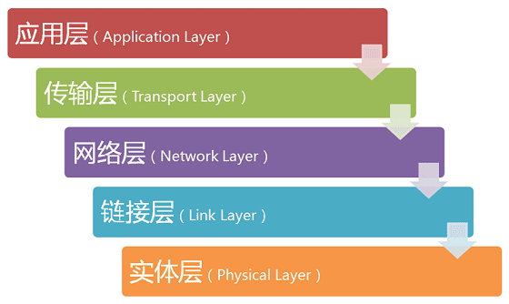
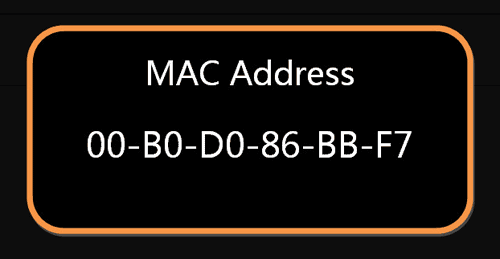
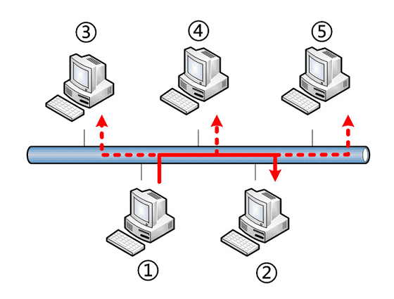
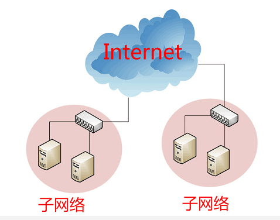
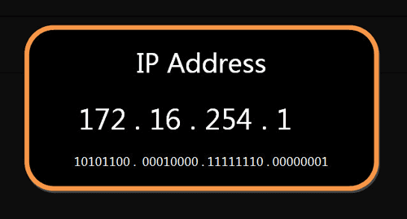
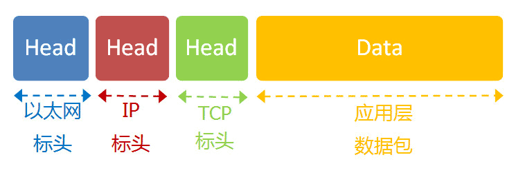

# 互联网的协议入门

- [互联网的协议入门](#互联网的协议入门)
  - [协议模型](#协议模型)
  - [实体层](#实体层)
  - [链接层](#链接层)
  - [网络层](#网络层)
  - [传输层](#传输层)
    - [UDP 协议](#udp-协议)
    - [TCP 协议](#tcp-协议)
    - [应用层](#应用层)
  - [总结](#总结)

## 协议模型

1. **五层模型**：互联网的实现，分成好几层。每一层都有自己的功能，就像建筑物一样，每一层都靠下一层支持。用户接触到的，只是最上面的一层，根本没有感觉到下面的层。要理解互联网，必须从最下层开始，自下而上理解每一层的功能。如何分层有不同的模型，有的模型分七层，有的分四层。我觉得，把互联网分成 `五层`，比较容易解释。
   - 越下面的层次，越靠近硬件；越上面的层次，越靠近用户。

    

2. **层与协议**：为了完成一种功能，大家都得遵循的一个规则就叫做 **协议** `protocol`。互联网的每一层，都定义了跟多协议，这些协议的总称叫做 **互联网协议** `Internet Protocol Suite`

## 实体层

电脑要组建网络，首先就需要物理的（光缆、电缆、双绞线、无线电波等方式）将电脑连接起来，这就叫做 **实体层**，他就是把电脑连接起来的物理手段。它主要规定了网络的一些电气特性，作用是用来发送 `0` 与 `1`。

## 链接层

1. 定义：单纯的 `0` 和 `1` 没有任何意义，必须规定解读方式：多少个电信号算一组？每个信号位有何意义？这就是 **链接层** 的功能，它在 **实体层** 的上方，确定了 `0` 和 `1` 的分组方式。

2. 以太网协议：早期的时候，每家公司都有自己的电信号分组方式。逐渐地，一种叫做 **以太网** `Ethernet` 的协议，占据了主导地位。
以太网规定，一组电信号构成一个数据包，叫做 **帧** `Frame`。每一帧分成两个部分：标头`（Head）`和数据`（Data）`。

    

    - 标头 包含数据包的一些说明，比如发送者、接受者、数据类型等等；
    - 数据则是数据包的具体内容。

    > "标头"的长度，固定为 18 字节。"数据"的长度，最短为 46 字节，最长为 1500 字节。因此，整个"帧"最短为 64 字节，最长为 1518 字节。如果数据很长，就必须分割成多个帧进行发送。

3. MAC 地址：以太网规定，连入网络的所有设备，都必须具有"网卡"接口。数据包必须是从一块网卡，传送到另一块网卡。网卡的地址，就是数据包的发送地址和接收地址，这叫做 MAC 地址。每块网卡出厂的时候，都有一个全世界独一无二的`MAC`地址，长度是`48`个二进制位，通常用`12 个十六进制数`表示。

    

    - ``前 6 个``十六进制数是厂商编号，``后 6 个``是该厂商的网卡流水号。有了`MAC`地址，就可以定位网卡和数据包的路径了。

4. 广播：定义地址只是第一步，后面还有很多步骤。
   - 首先就是，一块网卡如何知道另一块网卡的 `MAC` 地址？
     - 因为有一种 `ARP` 协议，可以解决这个问题。这个留到后面介绍，这里只需要知道，以太网数据包必须知道接收方的 `MAC` 地址，然后才能发送。
   - 其次，就算有了 `MAC` 地址，系统怎么才能把数据包准确送给到接受方？
     - 回答是以太网采用了一种很"原始"的方式，它不是把数据包准确送到接收方，而是向本网络内所有计算机发送，让每台计算机自己判断，是否为接收方。

     

   - 上图中，`1` 号计算机向 `2` 号计算机发送一个数据包，同一个子网络的`3`号、`4`号、`5`号计算机都会收到这个包。它们读取这个包的"标头"，找到接收方的`MAC`地址，然后与自身的`MAC`地址相比较，如果两者相同，就接受这个包，做进一步处理，否则就丢弃这个包。这种发送方式就叫做"广播"`（broadcasting）`。
   - 有了数据包的定义、网卡的`MAC`地址、广播的发送方式， 链接层 就可以在多台计算机之间传送数据了。

## 网络层

1. 网络层的由来：以太网协议，依靠`MAC`地址发送数据。理论上，单单依靠`MAC`地址，上海的网卡就可以找到洛杉矶的网卡了，技术上是可以实现的。但是，这样做有一个重大的缺点。以太网采用广播方式发送数据包，所有成员人手一"包"，不仅效率低，而且局限在发送者所在的子网络。也就是说，如果两台计算机不在同一个子网络，广播是传不过去的。这种设计是合理的，否则互联网上每一台计算机都会收到所有包，那会引起灾难。互联网是无数子网络共同组成的一个巨型网络，很像想象上海和洛杉矶的电脑会在同一个子网络，这几乎是不可能的。

       

   - 因此，必须找到一种方法，能够区分哪些`MAC`地址属于**同一个子网络**，哪些不是。如果是同一个子网络，就采用广播方式发送，否则就采用**路由**方式发送。（"路由"的意思，就是指如何向不同的子网络分发数据包，这是一个很大的主题，本文不涉及。） 遗憾的是，`MAC` 地址本身无法做到这一点。它只与厂商有关，与所处网络无关。
   - 这就导致了**网络层**的诞生。它的作用是引进一套新的地址，使得我们能够区分不同的计算机是否属于同一个子网络。这套地址就叫做`"网络地址"`，简称`"网址"`。
   - 于是，**"网络层"**出现以后，每台计算机有了两种地址，一种是`MAC`地址，另一种是网络地址。两种地址之间没有任何联系，`MAC`地址是绑定在网卡上的，网络地址则是管理员分配的，它们只是随机组合在一起。网络地址帮助我们确定计算机所在的子网络，`MAC`地址则将数据包送到该子网络中的目标网卡。因此，从逻辑上可以推断，必定是先处理网络地址，然后再处理`MAC`地址。

2. **IP 协议**
   - 规定网络地址的协议，叫做`IP`协议。它所定义的地址，就被称为`IP`地址。目前，广泛采用的是`IP`协议第四版，简称`IPv4`。这个版本规定，网络地址由`32 个二进制位`组成。

       

   - 习惯上，我们用分成四段的十进制数表示`IP`地址，从`0.0.0.0`一直到`255.255.255.255`。互联网上的每一台计算机，都会分配到一个`IP`地址。这个地址分成两个部分，前一部分代表**网络**，后一部分代表**主机**。比如，`IP`地址`172.16.254.1`，这是一个`32`位的地址，假定它的网络部分是前`24`位`（172.16.254）`，那么主机部分就是后`8`位（最后的那个 1）。处于同一个子网络的电脑，它们`IP`地址的网络部分必定是相同的，也就是说`172.16.254.2`应该与`172.16.254.1`处在同一个子网络。
   - 但是单单从 `IP` 地址，我们无法判断网络部分。还是以 `172.16.254.1` 为例，它的网络部分，到底是前`24`位，还是前`16`位，甚至前`28`位，从`IP`地址上是看不出来的。因此就需要另一个参数 `"子网掩码"（subnet mask）`
   - 所谓**"子网掩码"**，就是表示子网络特征的一个参数。它在形式上等同于 `IP` 地址，也是一个`32`位二进制数字，它的*网络部分*全部为`1`，*主机部分*全部为`0`。比如，IP 地址 172.16.254.1，如果已知网络部分是前 24 位，主机部分是后 8 位，那么子网络掩码就是 11111111.11111111.11111111.00000000，写成十进制就是 255.255.255.0。
   - 总结一下，IP 协议的作用主要有两个，一个是为每一台计算机分配 IP 地址，另一个是确定哪些地址在同一个子网络。

3. IP 数据包：根据 `IP` 协议发送的数据，就叫做 `IP 数据包`。不难想象，其中必定包括 IP 地址信息。但是前面说过，以太网数据包只包含`MAC`地址，并没有`IP`地址的栏位。那么是否需要修改数据定义，再添加一个栏位呢？
   - 回答是不需要，我们可以把`IP`数据包直接放进以太网数据包的**数据**部分，因此完全不用修改以太网的规格。这就是互联网分层结构的好处：上层的变动完全不涉及下层的结构。具体来说，IP 数据包也分为**标头**和**数据**两个部分。

       

   - **标头**部分主要包括版本、长度、IP 地址等信息，**数据**部分则是 IP 数据包的具体内容。它放进以太网数据包后，以太网数据包就变成了下面这样。

       

   - IP 数据包的**标头**部分的长度为 20 到 60 字节，整个数据包的总长度最大为 65,535 字节。因此，理论上，一个`IP`数据包的**数据**部分，最长为 65,515 字节。前面说过，以太网数据包的"数据"部分，最长只有 1500 字节。因此，如果 IP 数据包超过了 1500 字节，它就需要分割成几个以太网数据包，分开发送了。

4. ARP 协议
   - 关于**网络层**，还有最后一点需要说明。
   - 因为`IP`数据包是放在以太网数据包里发送的，所以我们必须同时知道两个地址，一个是对方的`MAC`地址，另一个是对方的`IP`地址。通常情况下，对方的`IP`地址是已知的（后文会解释），但是我们不知道它的`MAC`地址。所以，我们需要一种机制，能够从`IP`地址得到`MAC`地址。
   - 这里又可以分成两种情况。第一种情况，如果两台主机不在同一个子网络，那么事实上没有办法得到对方的`MAC`地址，只能把数据包传送到两个子网络连接处的"网关"（gateway），让网关去处理。
   - 第二种情况，如果两台主机在同一个子网络，那么我们可以用`ARP`协议，得到对方的`MAC`地址。`ARP`协议也是发出一个数据包（包含在以太网数据包中），其中包含它所要查询主机的`IP`地址，在对方的`MAC`地址这一栏，填的是`FF:FF:FF:FF:FF:FF`，表示这是一个**"广播"**地址。它所在子网络的每一台主机，都会收到这个数据包，从中取出`IP`地址，与自身的`IP`地址进行比较。如果两者相同，都做出回复，向对方报告自己的`MAC`地址，否则就丢弃这个包。
   - 总之，有了`ARP`协议之后，我们就可以得到同一个子网络内的主机`MAC`地址，可以把数据包发送到任意一台主机之上了。

## 传输层

传输层的由来：

- 有了`MAC`地址和`IP`地址，我们已经可以在互联网上任意两台主机上建立通信。接下来的问题是，同一台主机上有许多程序都需要用到网络，比如，你一边浏览网页，一边与朋友在线聊天。当一个数据包从互联网上发来的时候，你怎么知道，它是表示网页的内容，还是表示在线聊天的内容？
  - 也就是说，我们还需要一个参数，表示这个数据包到底供哪个程序（进程）使用。这个参数就叫做"端口"（port），它其实是每一个使用网卡的程序的编号。每个数据包都发到主机的特定端口，所以不同的程序就能取到自己所需要的数据。
  - **端口**是`0`到`65535`之间的一个整数，正好`16 个二进制位`。`0`到`1023`的端口被系统占用，用户只能选用`大于 1023`的端口。不管是浏览网页还是在线聊天，应用程序会随机选用一个端口，然后与服务器的相应端口联系。**"传输层"的功能，就是建立"端口到端口"的通信。相比之下，"网络层"的功能是建立"主机到主机"的通信。只要确定主机和端口，我们就能实现程序之间的交流。**因此，Unix 系统就把主机+端口，叫做"套接字"（socket）。有了它，就可以进行网络应用程序开发了。

### UDP 协议

现在，我们必须在数据包中加入端口信息，这就需要新的协议。最简单的实现叫做`UDP 协议`，它的格式几乎就是在数据前面，加上端口号。UDP 数据包，也是由**标头**和**数据**两部分组成。

**"标头"**部分主要定义了发出端口和接收端口，"数据"部分就是具体的内容。然后，把整个`UDP`数据包放入`IP`数据包的`"数据"`部分，而前面说过，`IP`数据包又是放在以太网数据包之中的，所以整个以太网数据包现在变成了下面这样：

`UDP`数据包非常简单，**"标头"**部分一共只有`8`个字节，总长度不超过 65,535 字节，正好放进一个 IP 数据包。

### TCP 协议

- UDP 协议的优点是比较简单，容易实现，但是缺点是可靠性较差，一旦数据包发出，**无法知道对方是否收到**。
- 为了解决这个问题，**提高网络可靠性**，`TCP 协议`就诞生了。这个协议非常复杂，但可以近似认为，它就是**有确认机制**的`UDP 协议`，每发出一个数据包都要求确认。如果有一个数据包遗失，就收不到确认，发出方就知道有必要重发这个数据包了。
- 因此，`TCP 协议`能够确保数据不会遗失。它的缺点是过程复杂、实现困难、消耗较多的资源。
- TCP 数据包和 UDP 数据包一样，都是**内嵌**在`IP 数据包`的"数据"部分。`TCP 数据包`没有长度限制，理论上可以无限长，但是为了保证网络的效率，通常 TCP 数据包的长度不会超过 IP 数据包的长度，以确保单个 TCP 数据包不必再分割。

### 应用层

- 应用程序收到"传输层"的数据，接下来就要进行解读。由于互联网是开放架构，数据来源五花八门，必须事先规定好格式，否则根本无法解读。
- **"应用层"的作用，就是规定应用程序的数据格式。**
- 举例来说，TCP 协议可以为各种各样的程序传递数据，比如 Email、WWW、FTP 等等。那么，必须有不同协议规定电子邮件、网页、FTP 数据的格式，这些应用程序协议就构成了"应用层"。
- 这是最高的一层，直接面对用户。它的数据就放在 TCP 数据包的"数据"部分。因此，现在的以太网的数据包就变成下面这样。

    

## 总结

至此，整个互联网的五层结构，自下而上全部讲完了。这是从系统的角度，解释互联网是如何构成的。下一篇，将反过来，从用户的角度，自上而下看看这个结构是如何发挥作用，完成一次网络数据交换的。
