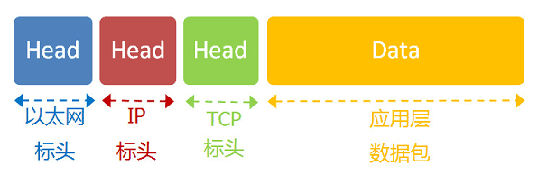
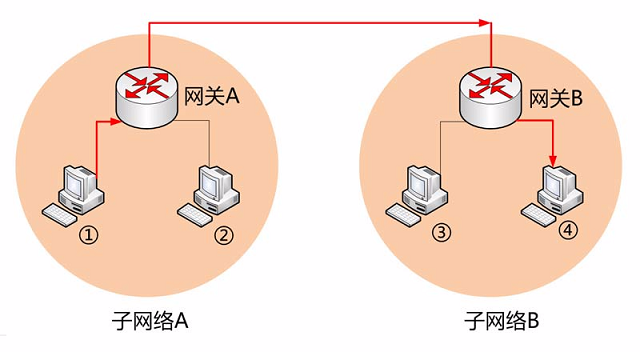
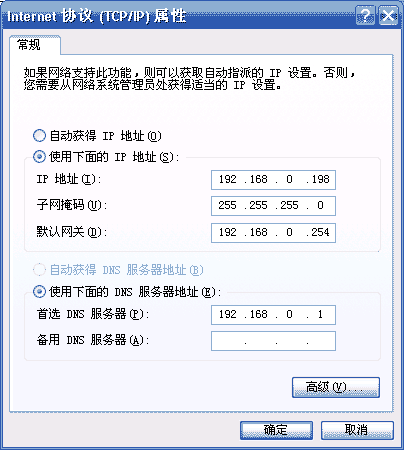
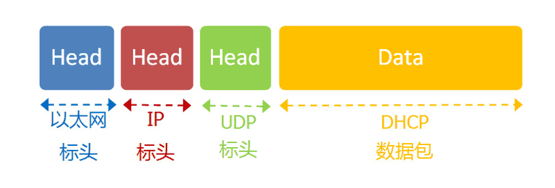
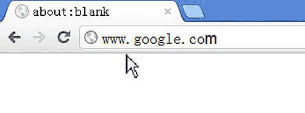
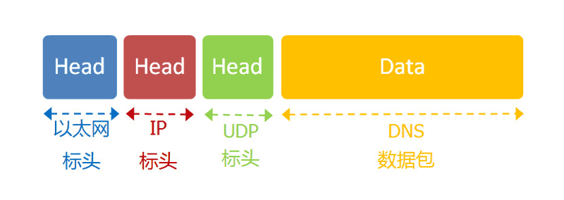
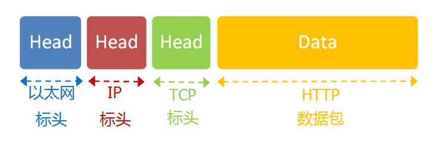
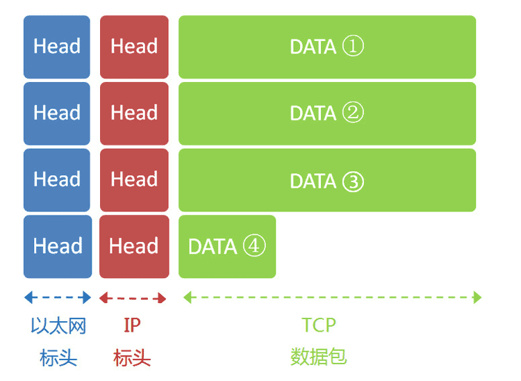

# 互联网协议基础

- [互联网协议基础](#互联网协议基础)
  - [一个小结](#一个小结)
  - [用户的上网设置](#用户的上网设置)
    - [静态 IP 地址](#静态-ip-地址)
    - [动态 IP 地址](#动态-ip-地址)
    - [DHCP 协议](#dhcp-协议)
  - [一个实例：访问网页](#一个实例访问网页)

## 一个小结

先对前面的内容，做一个小结：我们已经知道，网络通信就是交换数据包。电脑 A 向电脑 B 发送一个数据包，后者收到了，回复一个数据包，从而实现两台电脑之间的通信。数据包的结构，基本上是下面这样：



- 发送这个包，需要知道两个地址：
- 对方的 MAC 地址
- 对方的 IP 地址
- 有了这两个地址，数据包才能准确送到接收者手中。但是，前面说过，`MAC 地址`有局限性，如果两台电脑**不在**同一个子网络，就无法知道**对方的** `MAC 地址`，必须通过`网关（gateway）`转发。

    

- 上图中，`1` 号电脑要向 `4` 号电脑发送一个数据包。它先判断 `4` 号电脑是否在同一个子网络，结果发现不是（后文介绍判断方法），于是就把这个数据包发到**网关 A**。网关 A 通过路由协议，发现 `4` 号电脑位于**子网络 B**，又把数据包发给网关 B，网关 B 再转发到 4 号电脑。1 号电脑把数据包发到网关 A，必须知道网关 A 的 `MAC 地址`。所以，数据包的目标地址，实际上分成两种情况：

| 场景           | 数据包地址                      |
| -------------- | ------------------------------- |
| 同一个子网络   | 对方的 MAC 地址，对方的 IP 地址 |
| 非同一个子网络 | 网关的 MAC 地址，对方的 IP 地址 |

发送数据包之前，电脑必须判断对方是否在同一个子网络，然后选择相应的 `MAC 地址`。接下来，我们就来看，实际使用中，这个过程是怎么完成的。

## 用户的上网设置

### 静态 IP 地址

- 在链接网络之前，通常必须要进行一些设置。
  - 有时，管理员（或者 ISP）会告诉你下面四个参数，你把它们填入操作系统，计算机就能连上网了：
- **本机的 IP 地址**
- **子网掩码**
- **网关的 IP 地址**
- **DNS 的 IP 地址**
- 下图是 `Windows 系统`的设置窗口。

    

- 这四个参数缺一不可，后文会解释为什么需要知道它们才能上网。由于它们是给定的，计算机每次开机，都会分到同样的 `IP 地址`，所以这种情况被称作**静态 IP 地址上网**。但是，这样的设置很专业，普通用户望而生畏，而且如果一台电脑的 IP 地址保持不变，其他电脑就不能使用这个地址，不够灵活。出于这两个原因，大多数用户使用"动态 IP 地址上网"。

### 动态 IP 地址

- 所谓**动态 IP 地址**，指计算机开机后，会**自动分配**到一个 `IP 地址`，不用人为设定。它使用的协议叫做 [DHCP 协议](http://zh.wikipedia.org/zh/DHCP)。
  - 这个协议规定，每一个子网络中，有一台计算机负责管理本网络的所有 `IP 地址`，它叫做 `"DHCP 服务器"`。新的计算机加入网络，必须向 `"DHCP 服务器"`发送一个 `"DHCP 请求"`数据包，申请`IP 地址`和相关的网络参数。
  - 前面说过，如果两台计算机在同一个子网络，必须知道对方的 `MAC 地址`和 `IP 地址`，才能发送数据包。但是，新加入的计算机不知道这两个地址，怎么发送数据包呢？
    - DHCP 协议做了一些巧妙的规定。

### DHCP 协议

首先，它是一种应用层协议，建立在 `UDP 协议`之上，所以整个数据包是这样的：



1. 最前面的**以太网标头**，设置发出方（本机）的 `MAC 地址`和接收方`（DHCP 服务器）的 MAC 地址`。前者就是**本机网卡**的 `MAC 地址`，后者这时不知道，就填入一个广播地址：FF-FF-FF-FF-FF-FF。
2. 后面的 `"IP 标头"`，设置**发出方**的 `IP 地址`和**接收方**的 `IP 地址`。这时，对于这两者，本机都不知道。于是，发出方的 `IP 地址就设为 0.0.0.0`，接收方的`IP 地址设为 255.255.255.255`。
3. 最后的 `"UDP 标头"`，设置发出方的端口和接收方的端口。这一部分是 DHCP 协议规定好的，发出方是 `68 端口`，接收方是 `67 端口`。
4. 这个数据包构造完成后，就可以发出了。以太网是广播发送，同一个子网络的每台计算机都收到了这个包。因为接收方的 `MAC 地址`是 FF-FF-FF-FF-FF-FF，看不出是发给谁的，所以每台收到这个包的计算机，还必须分析这个包的 `IP 地址`，才能确定是不是发给自己的。当看到发出方 `IP 地址是 0.0.0.0`，`接收方是 255.255.255.255`，于是 DHCP 服务器知道"这个包是发给我的"，而其他计算机就可以丢弃这个包。
5. 接下来，DHCP 服务器读出这个包的数据内容，分配好 IP 地址，发送回去一个"DHCP 响应"数据包。这个响应包的结构也是类似的，以太网标头的 MAC 地址是双方的网卡地址，IP 标头的 IP 地址是 DHCP 服务器的 IP 地址（发出方）和 255.255.255.255（接收方），UDP 标头的端口是 67（发出方）和 68（接收方），分配给请求端的 IP 地址和本网络的具体参数则包含在 Data 部分。
6. 新加入的计算机收到这个响应包，于是就知道了自己的 IP 地址、子网掩码、网关地址、DNS 服务器等等参数。

## 一个实例：访问网页

- 我们假定，经过上一节的步骤，用户设置好了自己的网络参数：
  - 本机的 IP 地址：192.168.1.100
  - 子网掩码：255.255.255.0
  - 网关的 IP 地址：192.168.1.1
  - DNS 的 IP 地址：8.8.8.8

然后他打开浏览器，想要访问 Google，在地址栏输入了网址：www.google.com。



这意味着，浏览器要向 Google 发送一个网页请求的数据包。

- DNS 协议
  - 我们知道，发送数据包，必须要知道对方的`IP 地址`。但是，现在，我们只知道网址 www.google.com，不知道它的 `IP 地址`。
  - [DNS 协议](https://en.wikipedia.org/wiki/Domain_Name_System) 可以帮助我们，将这个网址转换成 `IP 地址`。已知 `DNS 服务器为 8.8.8.8`，于是我们向这个地址发送一个 **DNS 数据包（53 端口）**。

    

  - 然后，`DNS 服务器` 做出响应，告诉我们 Google 的 IP 地址是 172.194.72.105。于是，我们知道了对方的 IP 地址。

- 子网掩码
  - 接下来，我们要判断，这个`IP 地址`是不是在同一个子网络，这就要用到子网掩码。
  - 已知子网掩码是 255.255.255.0，本机用它对自己的`IP 地址 192.168.1.100`，做一个二进制的 AND 运算（两个数位都为 1，结果为 1，否则为 0），计算结果为 192.168.1.0；然后对 Google 的 IP 地址 172.194.72.105 也做一个 AND 运算，计算结果为 172.194.72.0。这两个结果不相等，所以结论是，Google 与本机不在同一个子网络。
  - 因此，我们要向 Google 发送数据包，必须通过网关 192.168.1.1 转发，也就是说，接收方的 MAC 地址将是网关的 MAC 地址。

- 应用层协议：浏览网页用的是 `HTTP 协议`，它的整个数据包构造是这样的：

    

HTTP 部分的内容，类似于下面这样：

```shell
　　GET / HTTP/1.1
　　Host: www.google.com
　　Connection: keep-alive
　　User-Agent: Mozilla/5.0 (Windows NT 6.1) ......
　　Accept: text/html,application/xhtml+xml,application/xml;q=0.9,*/*;q=0.8
　　Accept-Encoding: gzip,deflate,sdch
　　Accept-Language: zh-CN,zh;q=0.8
　　Accept-Charset: GBK,utf-8;q=0.7,*;q=0.3
　　Cookie: ... ...
```

我们假定这个部分的长度为 `4960 字节`，它会被嵌在 `TCP 数据包`之中。

- TCP 协议
  - TCP 数据包需要设置端口，接收方（Google）的 HTTP 端口默认是 80，发送方（本机）的端口是一个随机生成的 1024-65535 之间的整数，假定为 51775。
  - TCP 数据包的标头长度为 20 字节，加上嵌入 HTTP 的数据包，总长度变为 4980 字节。

- IP 协议
  - 然后，TCP 数据包再嵌入 IP 数据包。IP 数据包需要设置双方的 IP 地址，这是已知的，发送方是 192.168.1.100（本机），接收方是 172.194.72.105（Google）。
  - IP 数据包的标头长度为 20 字节，加上嵌入的 TCP 数据包，总长度变为 5000 字节。

- 以太网协议
  - 最后，`IP 数据包`嵌入以太网数据包。以太网数据包需要设置双方的 `MAC 地址`，发送方为本机的网卡 `MAC 地址`，接收方为网关 192.168.1.1 的 MAC 地址`（通过 ARP 协议得到）。`

以太网数据包的数据部分，最大长度为`1500 字节`，而现在的 IP 数据包长度为 `5000 字节`。因此，IP 数据包必须分割成四个包。因为每个包都有自己的 IP 标头（ 20 字节），所以四个包的 IP 数据包的长度分别为 1500、1500、1500、560。



- 服务器端响应
  - 经过多个网关的转发，Google 的服务器 172.194.72.105，收到了这四个以太网数据包。
  - 根据 IP 标头的序号，Google 将四个包拼起来，取出完整的 TCP 数据包，然后读出里面的" HTTP 请求"，接着做出" HTTP 响应"，再用 TCP 协议发回来。
  - 本机收到 HTTP 响应以后，就可以将网页显示出来，完成一次网络通信。

    

这个例子就到此为止，虽然经过了简化，但它大致上反映了互联网协议的整个通信过程。
